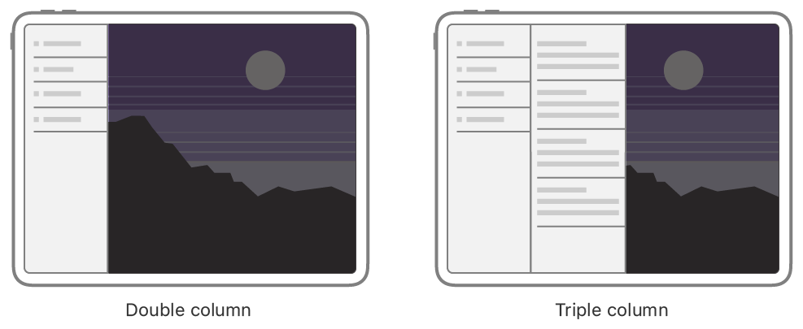
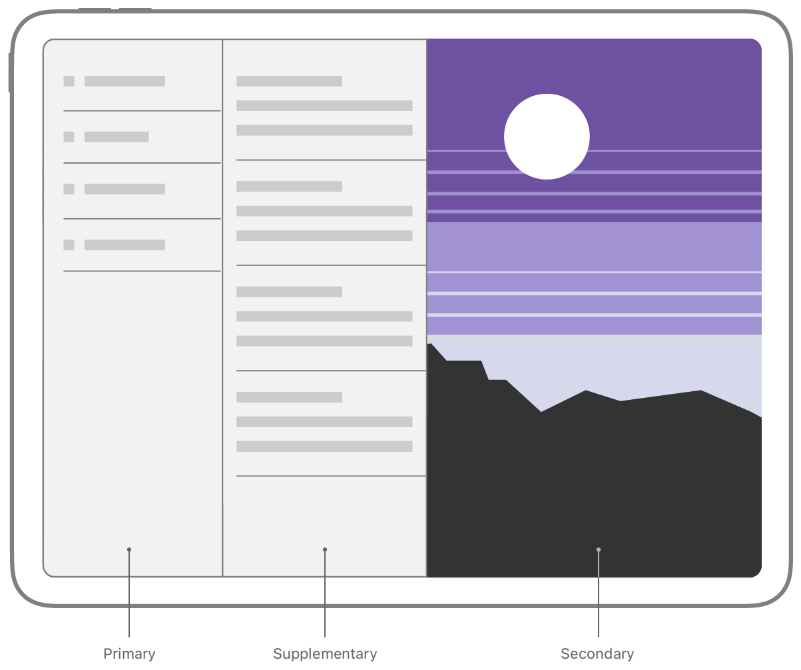
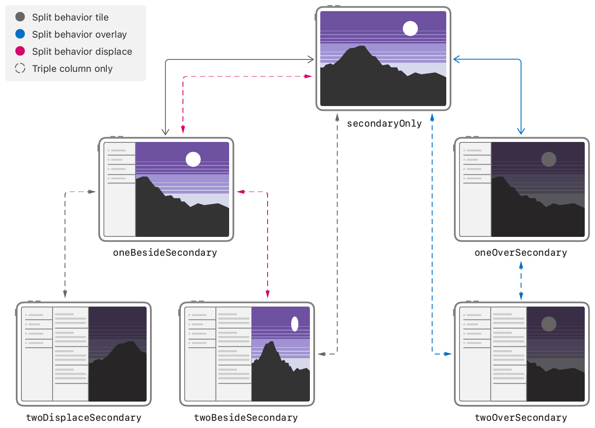
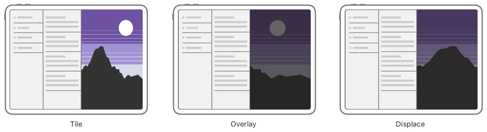

slide-dividers: #
theme: Courier, 3
slidenumbers: true
slidecount: true

# Build for iPad
## USAMI Kosuke

# 自己紹介

- 宇佐見 公輔
- フェンリル株式会社（大阪本社勤務、現在は在宅勤務）
- Mobile Act 主催
    - Mobile Act ONLINE #1（7/22）
    - 登壇者・参加者を募集中
- iOSDC 原稿応募を採択いただきました（執筆中）

# iPad アプリのセッション

この2つがおすすめ

- Designed for iPad（iPadの設計）
- Build for iPad（iPad用ビルド）

他にも、Apple Pencil、キーボード、トラックパッド、Catalyst なども注意

iPhone と Mac の中間のデバイスで、考えるべきことは多い

# Build for iPad

- Multi-column Split View
- Lists
- Reducing modality

# Multi-column Split View

# Multi-column Split View

- `UISplitViewController` に多くの API が追加された
- 参考 : API Document では次のように呼ばれている
    - 新しいもの : Column Style Split Views
    - 従来のもの : Classic Split Views
- iPad のサイドバーの実装に使う

# Multi-column Split View



# Style 指定

```swift
let splitViewController =
    UISplitViewController(style: .doubleColumn)

let splitViewController =
    UISplitViewController(style: .tripleColumn)
```

# Column 名称



Primary / Supplementary / Secondary

# Column 指定

```swift
splitViewController
    .setViewController(sidebarViewController, for: .primary)

splitViewController
    .setViewController(indexViewController, for: .supplementary)

splitViewController
    .setViewController(myHomeViewController, for: .secondary)
```

# Size Class 対応

- ナビゲーションのデザイン
    - Regular : サイドバー
    - Compact : タブバー
- `UISplitViewController` で共通実装

```swift
splitViewController
    .setViewController(tabBarController, for: .compact)
```

# Display Mode



# Split Behavior



# Split View の表示制御

- `preferredDisplayMode`
- `preferredSplitBehavior`
- `splitViewController.showColumn()` / `hideColumn()`

# Lists

# Lists

- 以下の箇所では Lists を使うことが多い
    - Primary View（サイドバー）
    - Supplementary View
- 実装には `UICollectionView` を使う

# Collection View setup

- `UICollectionLayoutListConfiguration` が追加された
- `appearance` : `.sidebar` / `.sidebarPlain`

```swift
let configuration =
    UICollectionLayoutListConfiguration(appearance: .sidebar)
let layout =
    UICollectionViewCompositionalLayout.list(using: configuration)
let collectionView =
    UICollectionView(frame: frame, collectionViewLayout: layout)
```

# Collection View の詳細

- このセッションでも解説はされているが、Collection View のためのセッションが別にあるので、それを見るとより良い
- 今回追加された以下はサイドバーの実装に有益
    - `UICollectionView.CellRegistration`
    - `UICollectionViewDiffableDataSource`

# まだ UITableView 使ってるの？

> If you're still using UITableView, we highly recommend you switch to UICollectionView.

もしあなたがまだ UITableView を使っているなら、UICollectionView に切り替えることを強くすすめる。

- サイドバー対応はそれにちょうど良いと思われる

# Reducing modality

# Reducing modality

- iPad のような広い画面を持つデバイスでは、モーダル表示は適切ではない
- 例 : メモアプリ
    - Color Picker で色を選択した後、Picker を閉じる操作をせずに線がかける
    - Color Picker は自動的に閉じる

# Reducing modality

- UIKit は Popover や Menu を自動的に閉じてくれる

# Case study : Shortcuts

# Case study : Shortcuts

- ショートカットアプリでの実例紹介
    - Multi-column Split View
    - Lists
    - Reducing modality
- Regular / Compact の切り替えについても解説されている

# まとめ

- Build for iPad は特にサイドバーの実装について参考になる
- Designed for iPad と合わせて見ると良い

