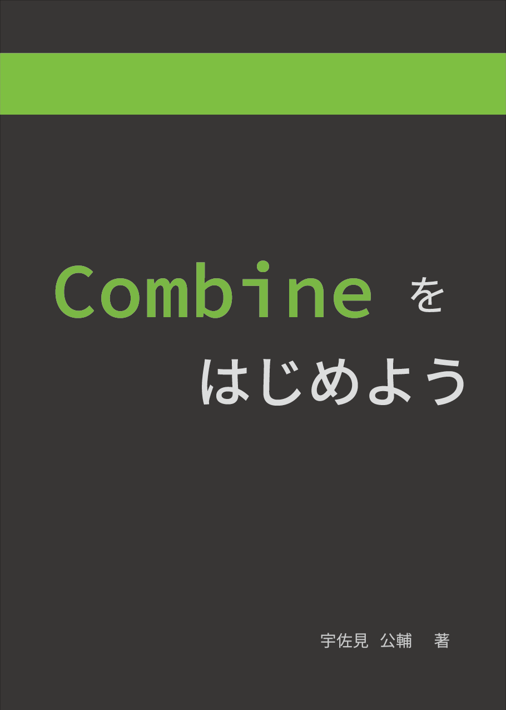

slide-dividers: #
theme: Courier, 3
slidenumbers: true
slidecount: true
slidenumber-style: Courier, text-scale(1.5)
header: YuGothic Bold
text: YuKyokasho Yoko Medium
code: SF Mono Regular

# Subject からはじめる Combine
## 宇佐見 公輔
### 2020-10-09

# 自己紹介

- 宇佐見 公輔
- フェンリル株式会社 iOS エンジニア
- Mobile Act ONLINE #1 で Combine の話をしました

# 技術同人誌の紹介



- 技術書典 9 で技術同人誌を出しました
- 現在、以下で販売中
    - [技術書典マーケット](https://techbookfest.org/product/5132216478728192)
    - [BOOTH](https://type-d4-lab.booth.pm/items/2377560)
    - [Zenn](https://zenn.dev/usamik26/books/a5883603f0260e446698)

# 今回の話

- 先ほどの「Combine をはじめよう」を書いた際の裏話
    - Xcode Playground の活用
    - Subject の活用

# Combine とは

- Swift のリアクティブプログラミングのフレームワーク
    - 類似のもの : RxSwift / ReactiveSwift
- 標準フレームワークのひとつに加わった
    - 今後、採用事例が増えると思われる
- 各種の非同期イベントのハンドリングに使うことができる

# Combine の敷居を下げたい

- リアクティブプログラミングって・・・
    - 敷居が高い、学習コストが高い、というイメージ
    - しかし、実はそんなに難しくない
    - そこで、敷居を下げたい

# 学ぶ方針

> プログラマであれば、言葉であれこれ説明する前に、
> 実際にコードを書いて動かしてみるのが理解が早いだろう
-- 「Combine をはじめよう」より抜粋

- Xcode Playground ですぐに動かせるコードを用意
    - すぐ動かせるようにすることで敷居を下げる狙い

# Xcode Playground ですぐ動かせる例

```swift
let subject = PassthroughSubject<String, Never>()

subject
    .sink { value in
        print("Received value:", value)
    }

subject.send("あ")
subject.send("い")
subject.send("う")
```

# Publisher に Subject を採用

- Publisher : 非同期イベントを送信するもの
    - まずはこれを知るのが Combine を知る第一歩
- 最初の Publisher として `PassthroughSubject` を採用
    - このやり方は、他の解説ではあまり見かけない
    - なぜ Subject を採用したのか？

# NotificationCenter の例

- Combine の解説でよく使われる

```swift
let myNotification = Notification.Name("MyNotification")
let publisher =
    NotificationCenter.default.publisher(for: myNotification)

publisher
    .sink { value in
        print("Received value:", value)
    }
```

# NotificationCenter の例の利点と欠点

- 利点：`NotificationCenter` は知っている人が多く、導入として分かりやすい
- 利点：標準で `publisher` メソッドが用意されていて便利
- 欠点：単純なイベントしか発生させられない

# Combine のイベント

- イベントは以下の 3 種類
    - 値
    - イベント完了（`.finished`）
    - エラー（`.failure`）
- これらを自由に発生させられるほうが学びやすい

# Subject の例

```swift
let subject = PassthroughSubject<String, MyError>()

subject.send("あ")
subject.send(completion: .finished)
subject.send(completion: .failure(.failed))

enum MyError: Error {
    case failed
}
```

# Subject の例の利点

- 3 種類のイベントを簡単に発生させられる
    - `NotificationCenter` は値のイベントしかなかった
- Xcode Playground でコードを書いて学ぶという方針に合致
    - だから Subject を採用した

# Subject の注意点

- 一般的な Publisher はイベントが流れてくるだけ
- Subject は `send` でイベントを意図的に発生させることができる
    - 便利な機能だが、Publisher としては余分な役割
- この点は Subject が Publisher の例として良くない理由になる

# Subject の型消去

- `Subject` を `AnyPublisher` 型として見せる

```swift
let subject = PassthroughSubject<String, Never>()
let publisher = subject.eraseToAnyPublisher()
```

- イベント受信側には `publisher` のほうを使わせる
- 実際のアプリ設計では、上述の方法を利用するのが好ましい

# まとめ

- Combine を学ぶには Xcode Playground が良い
- Subject は Xcode Playground での学びに向いている
    - ただし一般的な Publisher と異なる点もあるので注意

