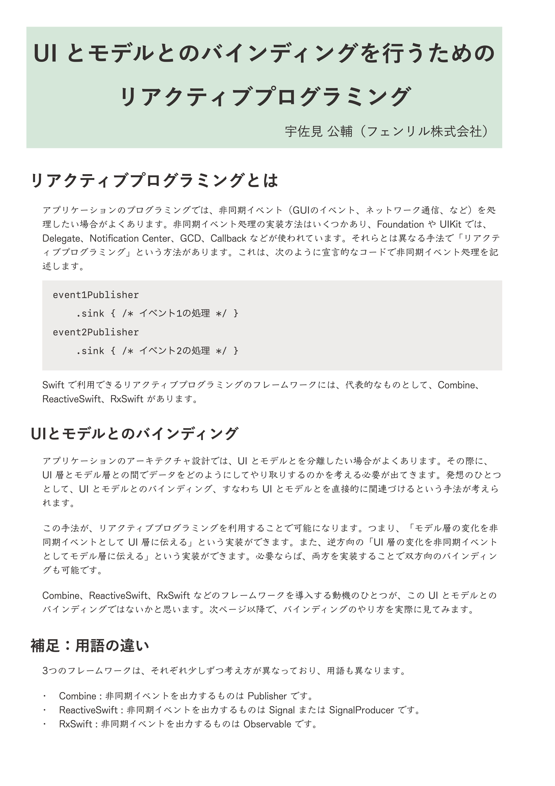

slide-dividers: #
theme: Courier, 3
slidenumbers: true
slidecount: true

# はじめての原稿投稿
## USAMI Kosuke

# 自己紹介

- 宇佐見 公輔
- フェンリル株式会社 iOS エンジニア
- Mobile Act 主催
    - 10/09（金）: Mobile Act ONLINE #2
    - connpass で参加募集中

# iOSDC パンフレット記事

- 今回はトークに加えてパンフレット記事が募集された
- 記事レイアウトとかやったことないが、なんとなく面白そう
- 原稿応募したところ、採択された🎉

# 採択された記事

- 2 本採択されました
    - iPad の SplitView や MultipleWindows に対応するための考慮すべきサイズ一覧
    - UI とモデルとのバインディングを行うためのリアクティブプログラミング

---

# 失敗

- 「記事レイアウトとかやったことない」のに自力でやる
- その結果として、失敗をしてしまった

---

# 文字が大きすぎる

- パンフレットの記事を読んだ人なら、やたら文字の大きい記事があったのにお気づきでしょうか
- 通常の倍くらいのサイズで、大きすぎて逆に読みづらい
- 文字を小さくすればもっと内容を増やすことができた

# そんなわけで

- どうすれば失敗せずにすんだか振り返ろう
- （もし来年も記事募集があったら今度は失敗しない？）

# 原稿を作るにあたって

- どんな内容を書くのか？
- 原稿をどうやって作るのか？
- 失敗しないためには？

# どんな内容を書くのか

# どんな内容を書くのか

- トークと記事の違いは何だろうか？
- 記事では、コード、表、図解、などを見せられる
    - トークスライドでは見せにくい

# 今回考えたこと

- iPad の記事の場合
    - iPad の機種一覧表を作ったら有益なのでは？
- リアクティブの記事の場合
    - Combine / ReactiveSwift / RxSwift のコードを並べて、見比べることができると面白いのでは？

# 逆にトークスライドのほうが良いこと

- iPad の Multiple Windows などの説明は、実際の動きをアニメーションで見せるほうが分かりやすい
- これは紙の記事ではできないこと

# どうやって作るのか

# 原稿をどうやって作るのか

- 例えばこんなツール
    - Apple Pages
    - Adobe InDesign
    - Affinity Publisher : 今回はこれを使いました

---

# 出力フォーマット

- カラーは RGB ではなく CMYK
- PDF/X というフォーマットにすると良い
    - 普通の PDF よりも印刷に特化
- 外側に数 mm の裁ち落とし領域を作る
    - iOSDC の原稿制作ガイドに記載あり

# 別の案

- 組版ができるツールでも良いかも
    - LaTeX
    - Re:VIEW

# 失敗しないためには

# 失敗しないためには

- 画面だけ見ていても紙に印刷したときの感じは分かりにくい
- 実際に、紙に印刷して確かめるべき
- PDF にしてコンビニで印刷すれば OK

# 紙のサイズ感

- 多くの技術書は B5 か A5、あるいはその変形版
- パンフレットは A4 であり技術書よりずっと大きい
- 1 ページに入る情報量はかなりのもの
- 二段組にするなどレイアウトの工夫ができるとベター

# なんだかんだ言っても

# 記事掲載は感動
## 次の機会があるなら、ぜひみなさんも挑戦してください

