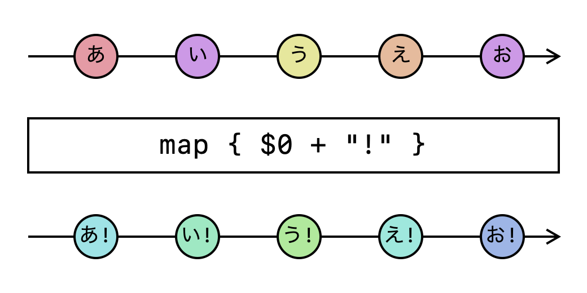
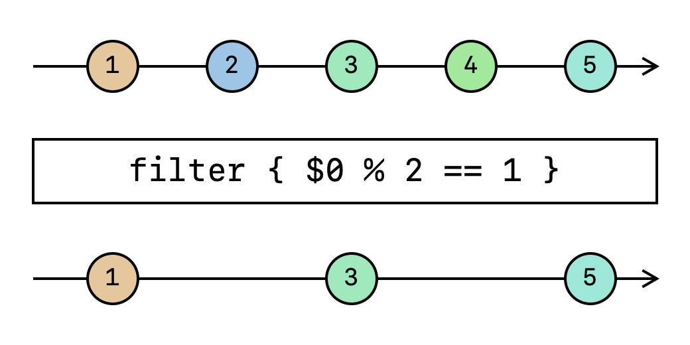

slide-dividers: #
theme: Courier, 3
slidenumbers: true
slidecount: true
slidenumber-style: Courier, text-scale(1.5)
header: YuGothic Bold
text: YuKyokasho Yoko Medium
code: SF Mono Regular

# 「Combine Operator ガイド」解説と補足
## 宇佐見 公輔
### 2021-09-27

# 宇佐見 公輔（@usamik26）

- iOS エンジニア
- フェンリル株式会社 iOS テックリード
- Mobile Act リーダー
- 技術同人誌を書いています
- ゆめみのお手伝いもしています

# iOSDCパンフレット記事を書きました

- Combine Operator ガイド
- PDF (BOOTH) 
    - [https://type-d4-lab.booth.pm/items/3309947](https://type-d4-lab.booth.pm/items/3309947)
- サンプルコード (GitHub)
    - [https://github.com/usami-k/CombineOperatorGuideSample](https://github.com/usami-k/CombineOperatorGuideSample)

# トークと記事

- iOSDC Japan 2021 のメインは、やはりトークセッション
    - みんなで同時視聴
    - Ask the Speaker
- 記事では上記のような盛り上がりは難しい
    - フィードバックをくれる人はいる、嬉しい

# そもそも記事読んでる？

- 後回しになりがち
- 能動的に読もうと意識しないと読めない
- 僕もわりと溜めがち・・・
    - 後で読む、リーディングリスト、積読、・・・

# ちょっと読んでみよう

- 今日は、記事の内容をざっと眺めてみる
- パンフレットを持っている人はぜひ見てね
- または PDF ダウンロード (BOOTH)

# Combine とは

- そもそも Combine ってなに？
    - オブジェクトからオブジェクトにイベントを伝える
    - 送信（Publisher）と受信（Subscriber）
- 小さく簡単なサンプルコードで紹介
    - Xcode Playground ですぐ試せる

# Operator

- 送信（Publisher）と受信（Subscriber）以外の第3の要素
- Operator は、Publisher を別の Publisher に変換する
- ここでは `map` Operator を紹介

# Marble Diagram

- Operator の図示

# Combine の利用シーン

- バインディング
    - ViewModel から ViewController へ値を伝える例
    - バインディングのときに Operator が役に立つ
- Combine でバインディングがきれいに書ける

# Publisher の型消去

- バインディングのコードの中で使っていた型消去の紹介
- Operator を複数使うと、Publisher の型が複雑になる
- 型消去するための `eraseToAnyPublisher` Operator がある
    - 複雑な型を `AnyPublisher` 型にする

# Operator の種類

- 公式リファレンスを見ると Operator の多さに圧倒される
- よく使うものを把握するのが大事

# 型を変換する

- 先に出した `map` の例では、型は同じで値だけ変換していた
- `map` で型を変換するパターンの紹介
- これは次の Optional 型の話につなぐための前置き

# Optional 型のアンラップ

- Optional 型をうまく扱うための Operator
    - `replaceNil`
    - `compactMap`

# 変換時のエラー

- エラーイベントを発生させる Operator
    - `tryMap`
- 次のエラーハンドリングの話につなぐ

# エラーハンドリング

- エラーハンドリングする Operator
    - `retry`
    - `replaceError`
    - `catch`
- このあたり紙面不足な感じがあるが、リトライは説明したかった

# フィルタリング

- 値を捨てる Operator
- いろいろあるが、Marble Diagram による図示でほぼ伝わるはず

# 複数の Publisher をまとめる

- 複数の Publisher をひとつにまとめる Operator
    - `combineLatest`
    - `zip`
    - `marge`

# 書かなかったこと：他の Operator

- 他に `decode` `flatMap` あたりも大事
- `decode` はさほど難しくないので省略した
- `flatMap` は逆に説明がごちゃつくので避けた
    - 何とかしたかったところではあるが・・・

# 書かなかったこと：非同期処理

- 非同期処理（ネットワーク通信など）
- `URLSession` の Publisher も大事ではある
- ただ、今後は async/await を使う方向になるだろう

# Swift Concurrency と Combine

- 記事執筆時点では Swift Concurrency に触れるのは困難だった
- Swift Concurrency は強力であり今後の主流
- Combine は非同期処理や並列処理よりも、バインディング用途

# 感想などあれば聞かせてください

- Combine Operator ガイド
- PDF (BOOTH) 
    - [https://type-d4-lab.booth.pm/items/3309947](https://type-d4-lab.booth.pm/items/3309947)
- サンプルコード (GitHub)
    - [https://github.com/usami-k/CombineOperatorGuideSample](https://github.com/usami-k/CombineOperatorGuideSample)
