slide-dividers: #
theme: Courier, 3
slidenumbers: true
slidecount: true
slidenumber-style: Courier, text-scale(1.5)
header: YuGothic Bold
text: YuKyokasho Yoko Medium
code: SF Mono Regular

# UIレンダリングの仕組みを知る
## 宇佐見 公輔
### 2021-08-12

# 宇佐見 公輔（@usamik26）

- iOS App 開発エンジニア / 技術同人誌を書いてます

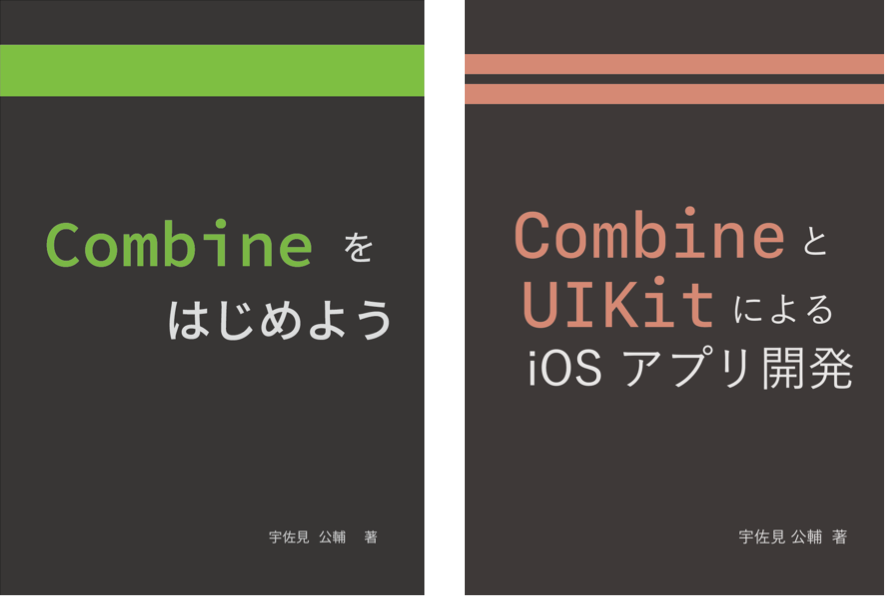

# Tech Talks とは

- WWDC セッション以外にも Apple が公開している動画がある
- Apple Developer App やサイトで見れる
- その中の Tech Talks がおもしろい

# 今日紹介する Tech Talks

- UI アニメーションの滞りおよびレンダーループに対する検討（Explore UI Animation Hitches and The Render Loop）
- 2020 年 12 月に公開された
- iOS App のスクロール時の表示のもたつきを改善する方法

# Hitch（滞り）

- フレームが予定より遅く表示されること
- 右の例は Frame 4 の表示が遅れた
- Frame 3 の表示で一瞬止まって見える

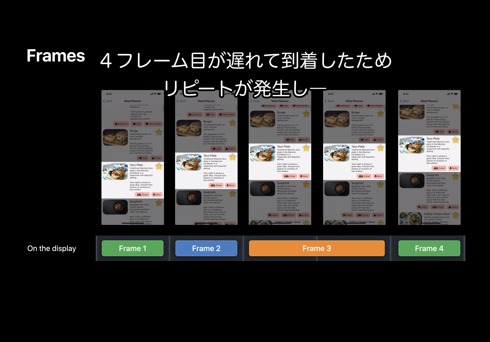

# Render Loop

- タッチイベントが App に渡されてから描画が終わるまでのプロセスのこと
- 3 段階に分かれる
- VSYNC に合わせ時間内に処理が必要
- iPhone/iPad : 16.67ms（60Hz）
- iPad Pro : 8.33ms（120Hz）

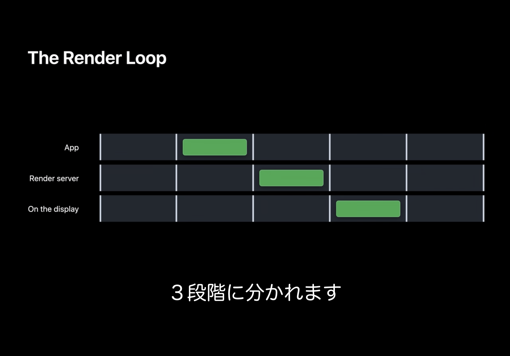

# Commit フェーズ

- Render Loop の 1 段階目
- レイアウト
    - View の生成や配置
    - `layoutSubviews`
- 表示
    - View の `drawRect`
- View の階層構造は保持される

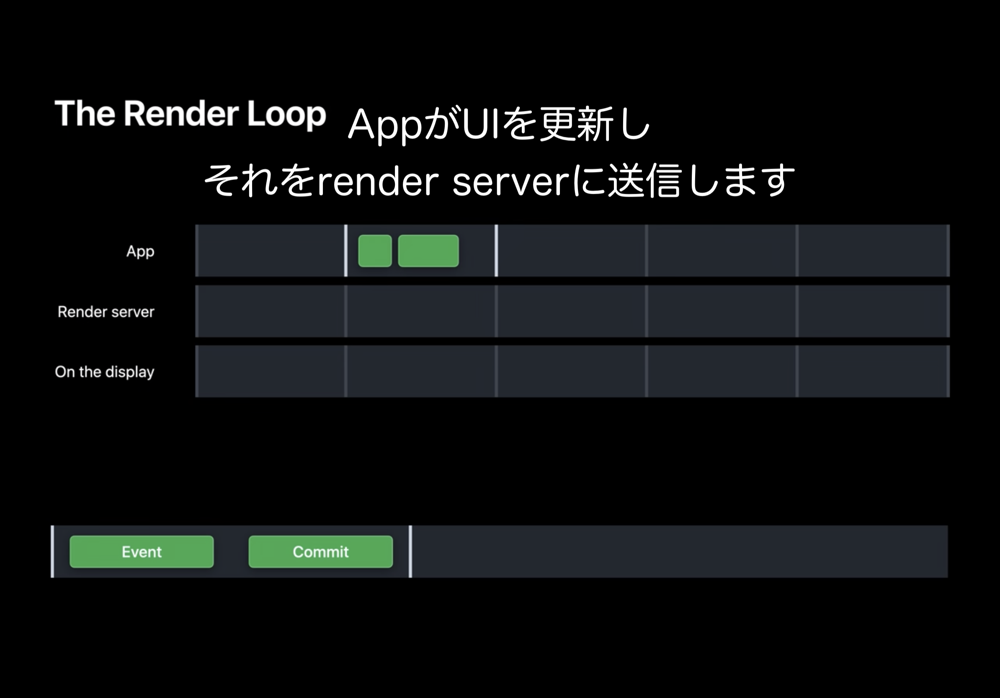

# Render フェーズ

- Render Loop の 2 段階目
- Commit された View 構造を、表示画面として描画する
- View の重ね合わせ、シャドウ、アニメーションなど
- Render server は App とは別プロセスだが、開発者の責任

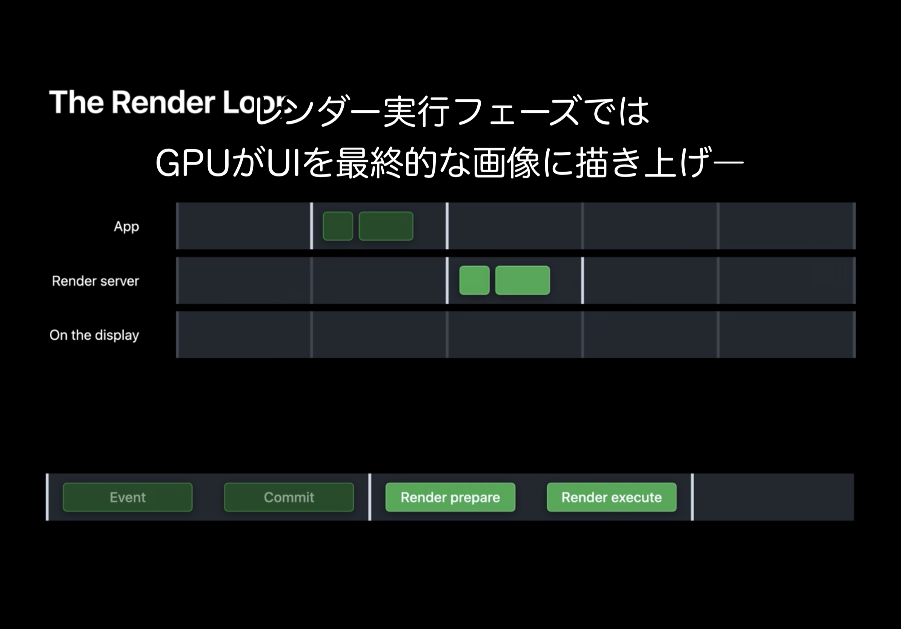

# 表示

- Render Loop の 3 段階目
- レンダリングされたものを表示

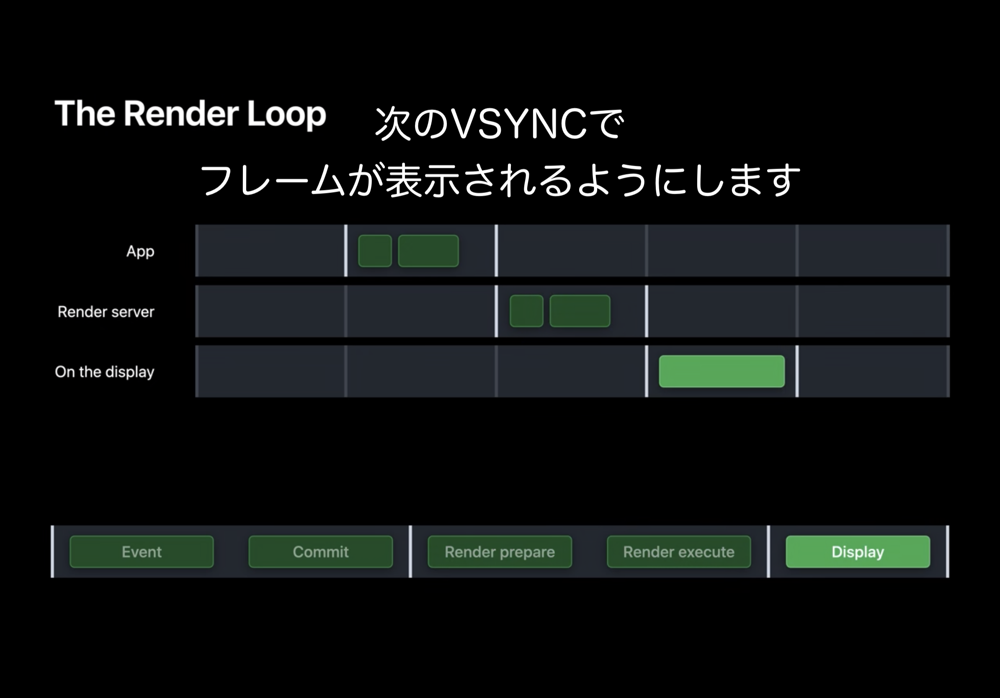

# 並列実行

- Render Loop は並列実行される
- ダブルバッファリング
- 表示の裏で Render フェーズ
- Render の裏で Commit フェーズ
- 各フェーズで時間制限を守る必要がある
    - 守らないと Hitch が発生する

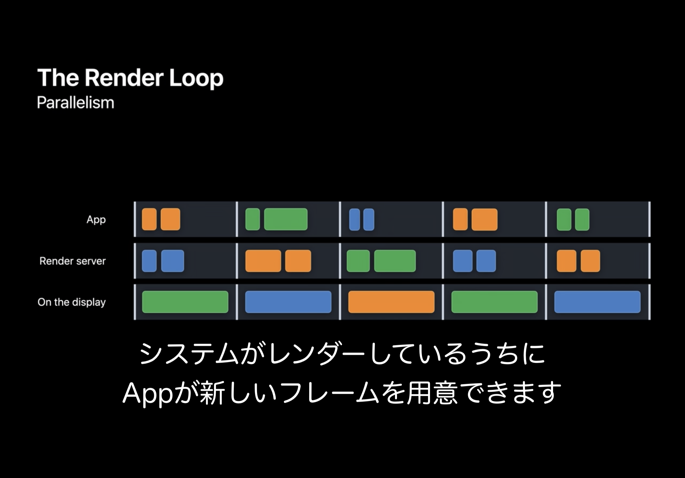

# 許容される範囲

- Hitch time ratio
    - 1 秒あたり何 ms の hitch があるか
- 0 ms/s が理想
- 5 ms/s 以下なら Good
    - つまり数秒に 1 回程度なら大丈夫
- それを超えると要調査

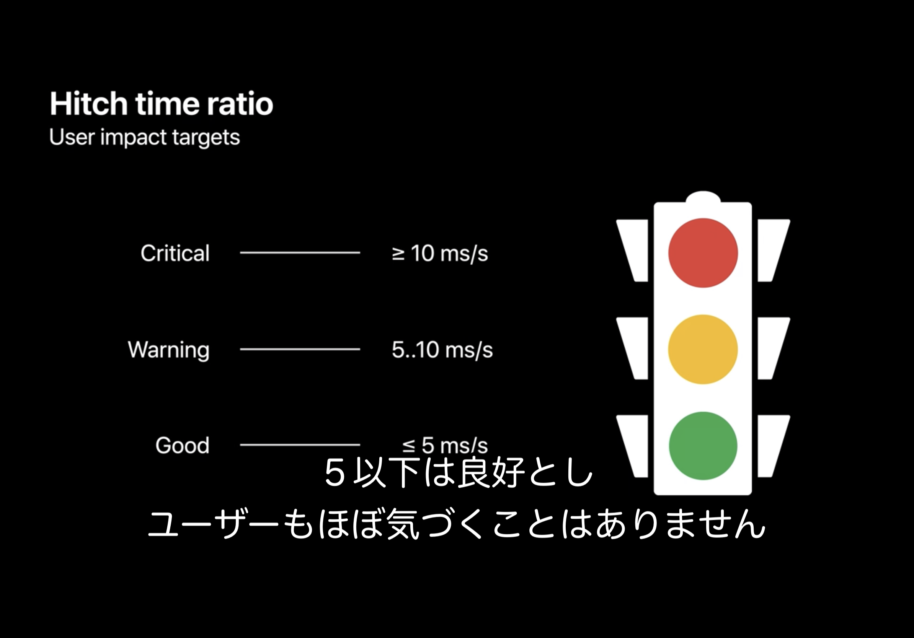

# Hitch の調査

- Instruments を使って調査できる
- 右の例では、Commit フェーズに時間がかかっている
- 具体的に何 ms かかっているかも見れる

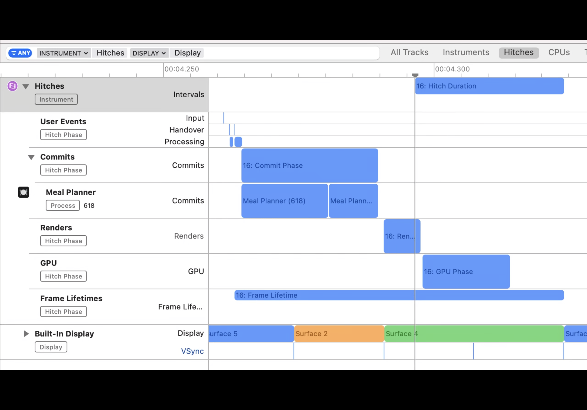

# 問題の処理を探す

- さらに Time Profiler でどの関数で時間がかかっているか見れる

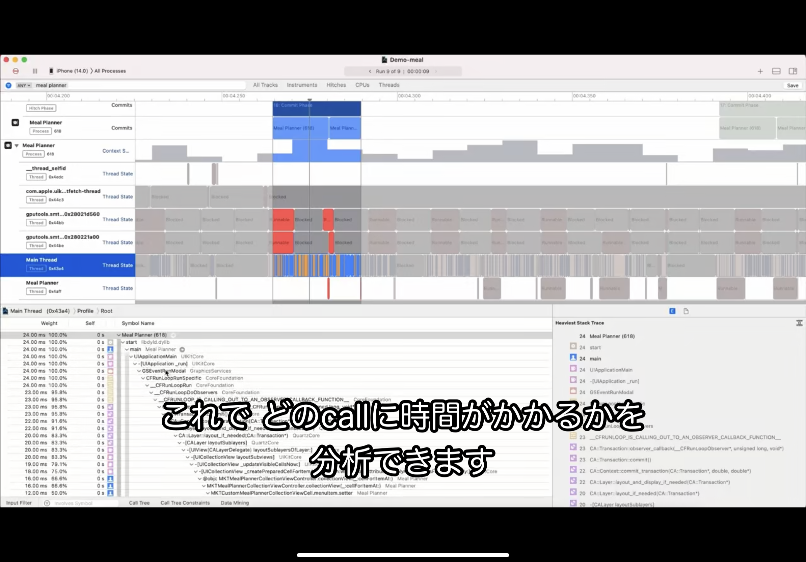

# 問題の処理を改善する

- Collection View Cell で問題があった
- `prepareForReuse` で、Cell 内の View を削除して生成しなおしていた
- View を再利用するよう変更すればよい

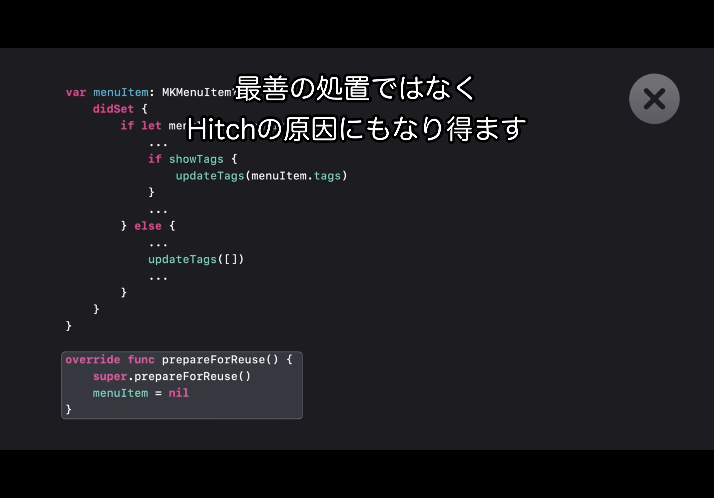

# Commit Hitch の回避

- 前述の Hitch は Commit フェーズで発生した
- Commit フェーズで気をつけるべきことは他にもある
- 例 : レイアウト更新のとき、`layoutIfNeeded` の使用を避けて `setNeedsLayout` の使用がおすすめ

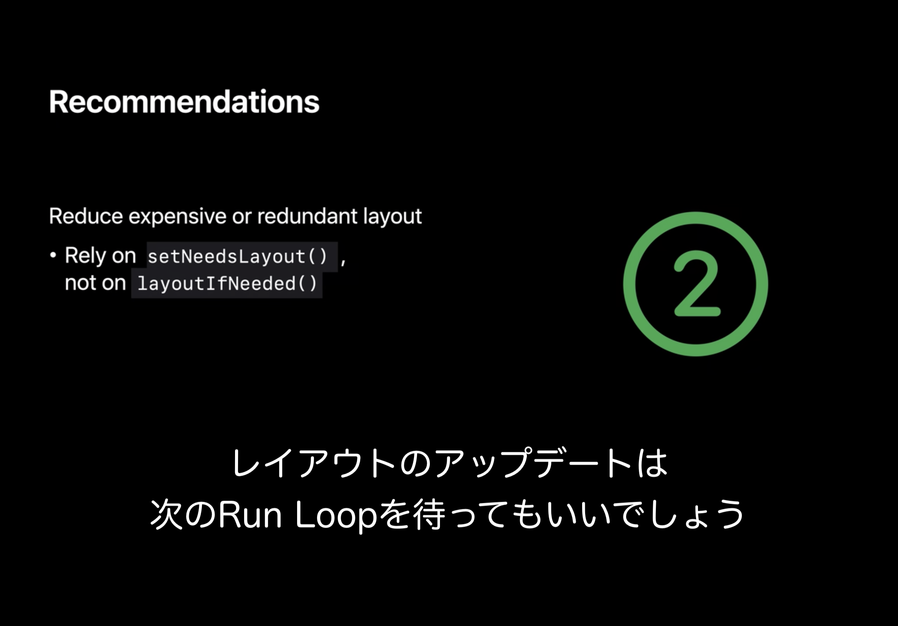

# Offscreen Pass

- Render フェーズで時間がかかる事例
- 右の例では、影の形を調べるために別の場所に図形を描画している

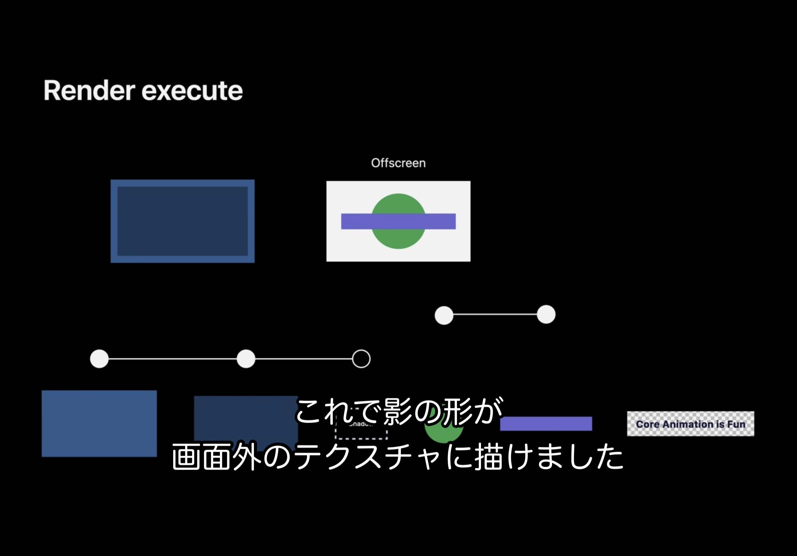

# Render の問題を発見

- Xcode の View Debugger で問題箇所と改善方法を指摘してくれる
- 右の例では、影の描画で問題が指摘されている
- 改善方法として `shadowPath` の指定が提案されている

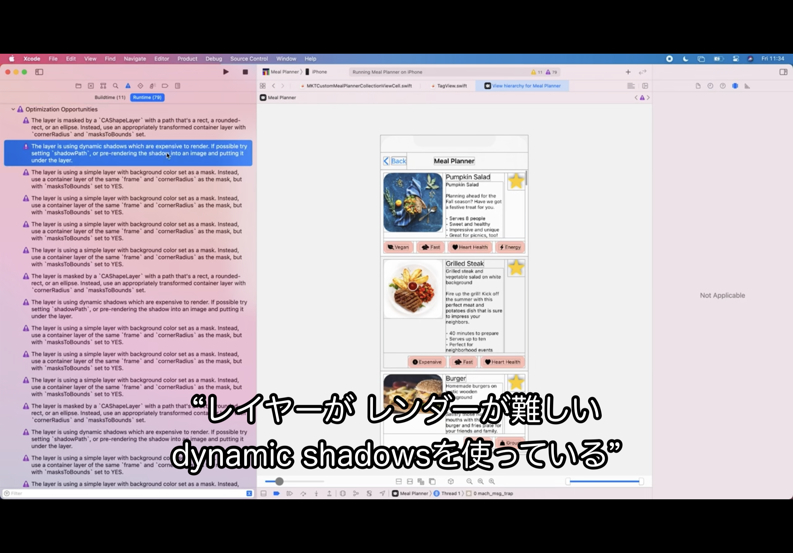

# 指摘箇所の改善

- 提案されたとおり `shadowPath` を明示的に指定する
- これで Offscreen Pass を減らして Render フェーズの処理時間が改善した

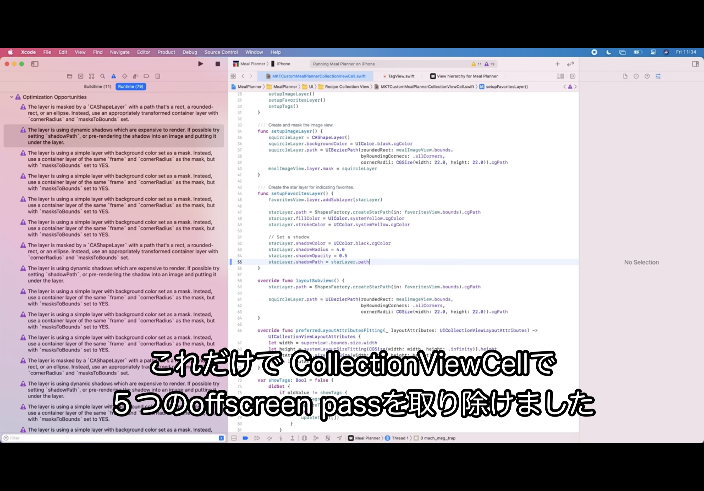

# 参考（Tech Talks）

- UIアニメーションの滞りおよびレンダーループに対する検討（Explore UI Animation Hitches and The Render Loop）
- コミットフェーズでの滞りを見つけ修正する（Find and Fix Hitches in the Commit Phase）
- レンダリングフェーズでの滞りを紐解き排除する（Demystify and Eliminate Hitches in the Render 
