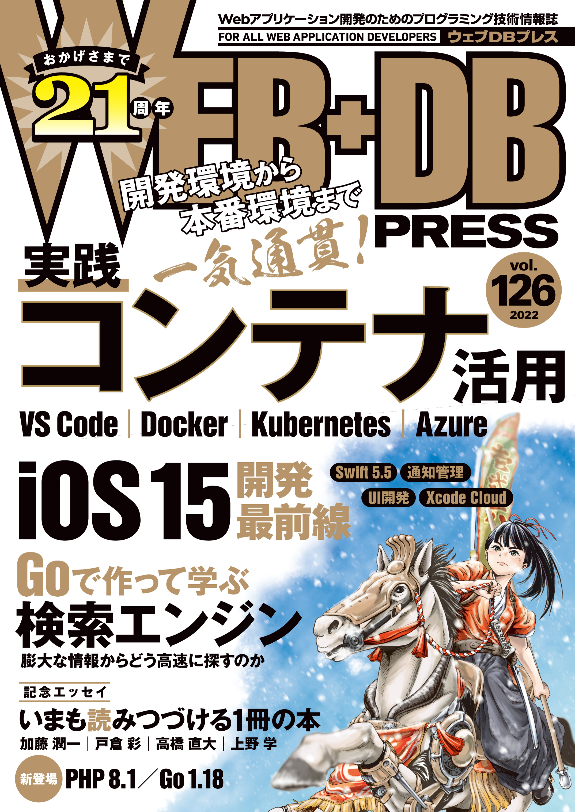
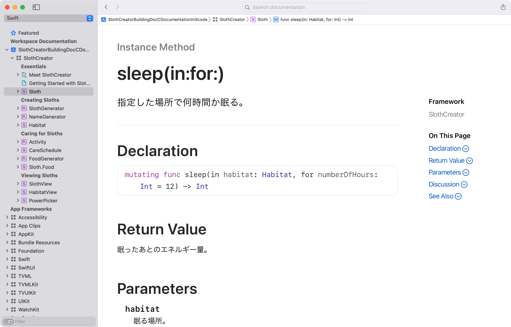
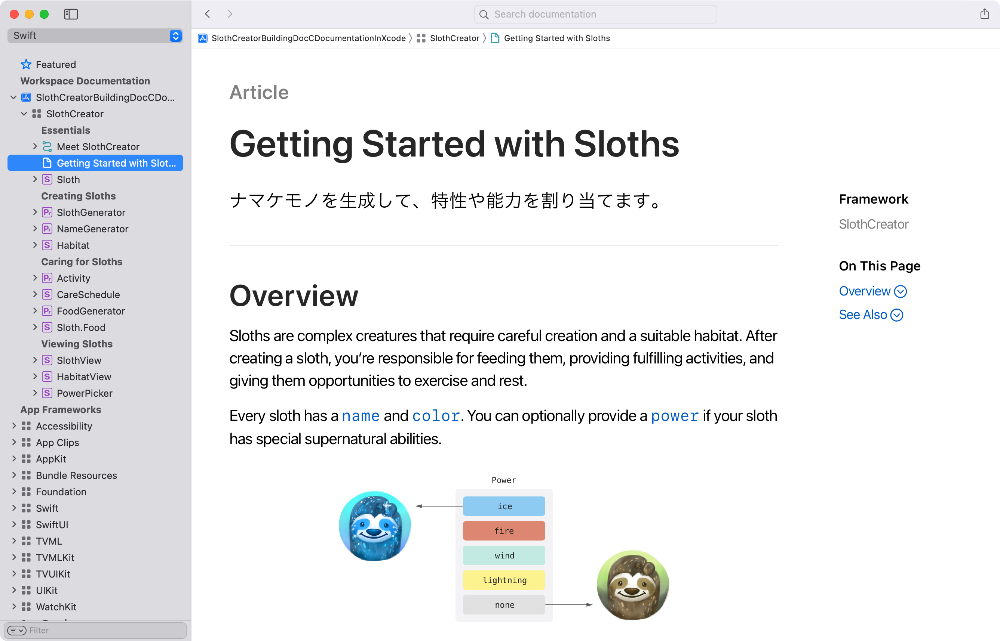
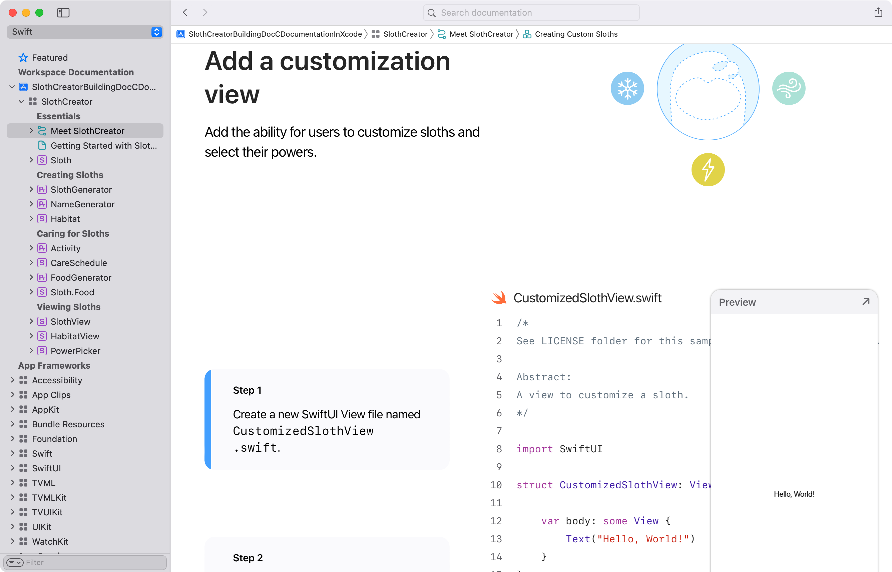
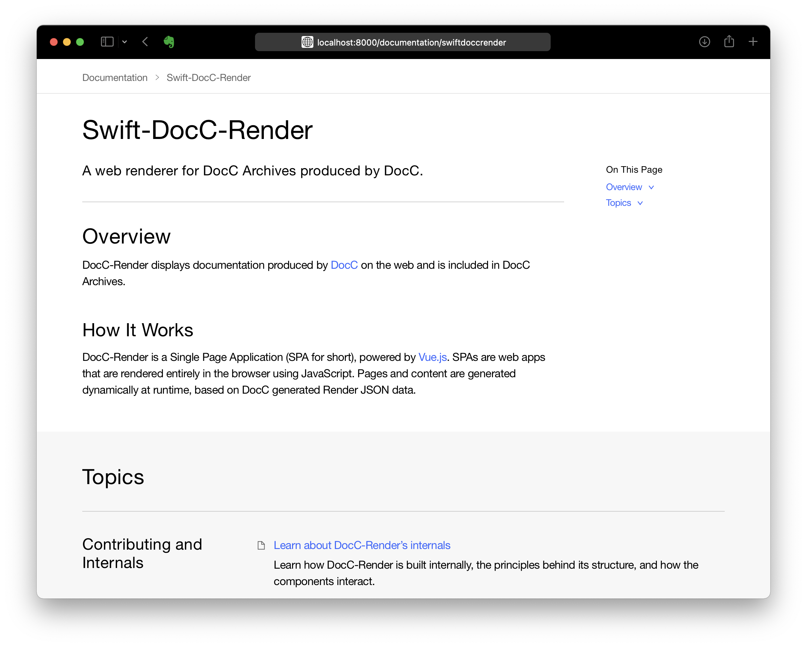

slide-dividers: #
theme: Courier, 3
slidenumbers: true
slidecount: true
slidenumber-style: Courier, text-scale(1.5)
header: YuGothic Bold
text: YuKyokasho Yoko Medium
code: DejaVu Sans Mono

# Swift-DocCによるドキュメントの作成と活用
## 宇佐見 公輔
### 2021-12-17

# 宇佐見 公輔（@usamik26）

- iOS App エンジニア
- WEB+DB PRESS Vol.126 の iOS 15 特集で記事を執筆しました
    - 12/24（金）発売
    - DocC の話も書きました

# WEB+DB PRESS に書いたこと

- DocC とは
- リファレンス
- アーティクル
- チュートリアル

# DocC とは

- API リファレンスなどのドキュメントを作成するツール
    - 他には Jazzy や swift-doc などがある
- Apple 公式
- Xcode と連携
- オープンソース

# リファレンス

- ソースコードコメントから生成
    - コメントにスラッシュ3つ `///` を使う 
- Xcode 付属 API リファレンスと同じ外観
    - 馴染みのある見た目で読みやすい

# アーティクル

- 独立した Markdown ファイルから生成
- Xcode プロジェクトと紐づけて管理
    - Documentation Catalog

# チュートリアル

- SwiftUI チュートリアルと同じ外観
- Markdown + 拡張文法で記述する
    - Apple が出しているサンプルプロジェクトが参考になる

# WEB+DB PRESS に書けなかったこと

- Webブラウザでの表示
- フレームワーク以外での活用

# Webブラウザでの表示

- Documentation Archive
    - 生成されたドキュメントをエクスポート
- Single Page Web App の構造
    - Web サーバ側を設定すればそのまま公開可能
    - とはいえ、それはちょっと面倒・・・

# Swift-DocC-Render

- `apple/swift-docc-render`
- Apple 公式
    - 公式でサポートしてくれたのは嬉しい
- Vue.js で作られている

# VaporDocC

- `JosephDuffy/VaporDocC`
- Vapor で作られている（サーバサード Swift）
- Docker イメージもある
- 参考記事：[DocC の成果物を Web ブラウザで簡単に閲覧する方法](https://zenn.dev/griffin_stewie/articles/2106120847_docc_docker)（griffin_stewie さん）

# フレームワーク以外での活用

- 基本的にはフレームワークまたはライブラリ向けのツール
- しかし、アプリでも使えると便利かも？
    - 開発中のプロジェクトのドキュメントを書くとか

# アプリのプロジェクトでドキュメント生成？

- アプリ Target で Build Documentation コマンドを実行しても、ドキュメントが生成されない・・・？
    - ・・・なぜ？
    - （まだ理解できてない、分かる人いたら教えてください）

# マルチモジュール

- マルチモジュールを採用するとドキュメント生成できる
    - アプリのプロジェクトでも、フレームワークやライブラリの部分はドキュメント生成できる
- `public` なプロパティやメソッドだけリファレンスが作成される点には注意
    - モジュールを細かく分けるやり方が向いている

# まとめ

- Webブラウザでの表示
    - 最初の頃は難しかったけど、現在は解消された
- フレームワーク以外での活用
    - 工夫次第で活用は可能
    - マルチモジュールと相性が良い
