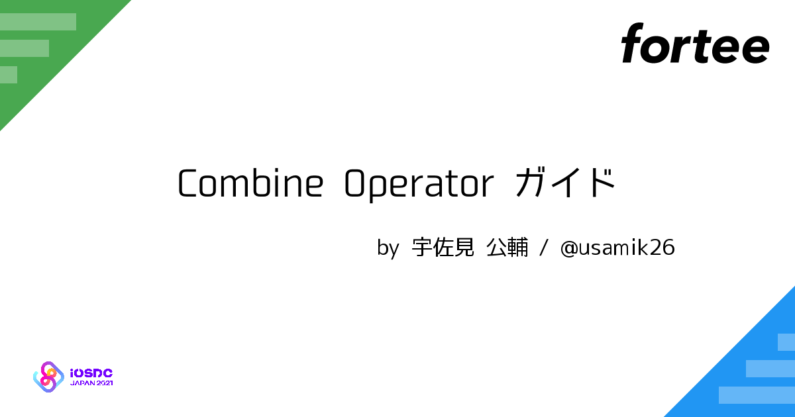

slide-dividers: #
theme: Courier, 3
slidenumbers: true
slidecount: true
slidenumber-style: Courier, text-scale(1.5)
header: YuGothic Bold
text: YuKyokasho Yoko Medium
code: SF Mono Regular

# パンフレット記事をこうやって書きました
## 宇佐見 公輔
### iOSDC Japan 2021
### アンカンファレンス

# 宇佐見 公輔（@usamik26）

- [Combine Operator ガイド](https://fortee.jp/iosdc-japan-2021/proposal/e39b0c5c-d7b7-4453-8424-86cefdc62f55) を書きました



- forteeで記事へのフィードバックお願いします（トークと同様）
- SNSでの拡散も歓迎です

# iOSDCのトーク募集

- 2種類の募集があった（2020 / 2021）
    - トーク募集
    - パンフレット原稿募集

# スケジュール

- トーク
    - 募集締切 : 6/28 → 収録 : 8/26〜9/5
- 原稿
    - 募集締切 : 6/6 → 入稿 : 7/31
- 原稿のほうが1ヶ月くらい早い

# 原稿の形式

- サイズ : A4
- ページ数 : 2 / 4 / 8
- フルカラー
- レイアウト済みのファイルを入稿する
    - 入稿したまま掲載される

# どうやってレイアウトする？

- 本格派 : Adobe InDesign / Affinity Publisher
- 手軽 : Apple Pages / Microsoft Word / Google Docs
- プレーンテキスト : Re:VIEW / Vivliostyle / その他いろいろ

# 執筆・レイアウトの手段の選択

- 自分一人でやる？
    - すでに慣れている手法があれば、それが良い
        - 今回は個人的に慣れているRe:VIEWを採用
- 誰かと協力してやる？
    - 紙面レイアウトができる人がいるなら、お任せもあり
    - 共同執筆なら、共同作業のしやすさも大事

# A4サイズについて

- 技術書や雑誌に比べて紙面が大きい
    - 論文ではA4はよく使われるが、本では少ない
- 自由度が高い
    - 小さな文字を詰め込むのもあり
    - 大きな文字で目立たせるのもあり

# レイアウト設計を考える

- 大きい紙面をどう使うか？
    - 横幅が長いコードを見せやすい
    - 一方、二段組にする選択肢もありうる
- 画像をどう見せるか？
    - フルカラーなので画像が綺麗に見える！

# 二段組

- 二段組を採用
    - コードをたくさん例示したかった
    - 画像は小さめでも良いことにした
- 二段組を実現できるツールの採用が必要になる
    - 今回はRe:VIEWでどうにか対応できたので決行した

# その他のレイアウト調整

- コードの横幅の問題
    - フォントサイズを小さくすることで対処した
    - 細身のフォントを選択するのもあり
        - 今回は SF Mono フォントにこだわった
- 実際に印刷して確認する
    - ちゃんと読めるかどうか？

# Re:VIEW

- プレーンテキストでの執筆ツール
    - 主に技術書の執筆で使われる
- PDFやEPUBを生成できる
    - PDF生成にはLaTeXを利用

# Re:VIEW + LaTeX

- 二段組 : `embed`コマンドでLaTeXコードを埋めて実現

```
//embed{
\twocolumn
//}
```

- 見出しのカスタマイズ : LaTeXのスタイルファイルで実現
    - `review-custom.sty` に書けば良い

# 補助ツール

- 文章を体裁を整える : textlint
    - VS Code 拡張でリアルタイムにチェックされる
- Marble Diagram を作成する : swirly
    - プレーンテキストから画像を生成してくれる

# ページ数

- A4、8ページ、二段組
    - 結構な分量が書ける
- よし、じゃあ狙いどおりコードをたくさん載せよう
    - あれ、ページが足りないんだが・・・
    - ちょっと内容削ろう・・・（それで良かったのか？）

# まとめ

- 今後、技術記事や技術書を書きたい人の参考になれば幸いです
- forteeで記事へのフィードバックをぜひお願いします
