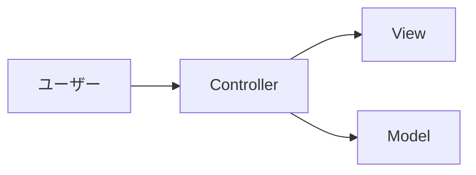
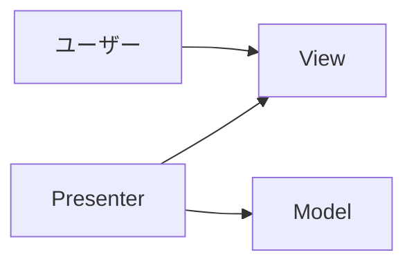
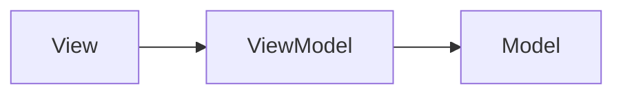

# アーキテクチャ概論

  
    宇佐見公輔 / 株式会社ゆめみ
  

---

# 自己紹介

* 宇佐見公輔（うさみこうすけ）
* 書籍：Combineをはじめよう https://nextpublishing.jp/book/14353.html

---
layout: section
---

# なぜアプリの設計を 考えるのか

---

# なぜアプリの設計を考えるのか

* 細かいこと気にせずに、作ったものが動けばいいよね？
* そんなにちゃんと設計する必要ある？
* かえってややこしくなって、開発が大変になるんじゃない？

<mdi-arrow-down-thick class="text-2xl mx-50" />
<v-click>

* 実のところ、間違いというわけではない。
* 単純なアプリなら、設計を考えなくても大丈夫。
* 複雑なアプリなら、設計を考える必要が出てくる。

</v-click>

---

# 複雑なアプリが増えている

* スマートフォンは、みんなが当たり前のように使うデバイスとなった。
* スマートフォンのアプリで「これくらいはできて当たり前」というレベルが上がっている。
* ユーザーからの、アプリに対する期待が高くなっている。
* ひとつのアプリの中に、多くの画面、多くの機能が含まれるようになっている。

---

# 開発が継続的になっている

* 一度開発したら終わり、ではなくなった。
* Webのように、少しずつ機能追加してリリースするのが当たり前になっている。
* 継続的にリリースするために、古いライブラリの移行なども行われる。
* チーム開発が普通になり、開発メンバーが入れ替わることもよくある。

---

# 複雑化するアプリ開発への対応

* 複雑なアプリが増えている。
* 開発が継続的になっている。

<mdi-arrow-down-thick class="text-2xl mx-50" />
<v-click>

* 複雑なものを、複雑なまま継続的に扱っていくのは難しい。

<mdi-arrow-down-thick class="text-2xl mx-50" />

* 複雑なものを、単純なものに分割する。
* それを、アプリの設計で実現する。

</v-click>

---
layout: section
---

# アプリの設計と 設計パターン

---

# アプリの設計とは何か

* 複雑なものを、単純なものに分割する。

<mdi-arrow-down-thick class="text-2xl mx-50" />
<v-click>

* ソフトウェアを、部品の集まりとして作る。
* それぞれの部品は、限られた小さな問題を扱う。
* それらの組み合わせで、大きな問題を解決する。

</v-click>

---

# どうやって部品にするのか

* 現代のプログラミング言語は、部品を作る仕組みをいろいろ備えている。
* 構造体、クラス、モジュール、フレームワーク、ライブラリ、など。
* しかし、どのように問題を分割して部品化すればいいのか？

---

# アプリは「一点物」

* 一点物（いってんもの）＝それ以外に同じものがない品物。
* もちろん、アプリはデジタルデータであって、コピーできるが・・・。

<mdi-arrow-down-thick class="text-2xl mx-50" />
<v-click>

* アプリを開発するときに、別のアプリをただ持ってくるだけ、ということは通常あり得ない。
* 違うものが欲しいから、アプリを開発する。
* その意味で、アプリは他にはない一点物として開発することになる。

<mdi-arrow-down-thick class="text-2xl mx-50" />

* したがって、そのアプリに適切な設計を、毎回考えなければならない。

</v-click>

---

# 設計パターン

* アプリの適切な設計は、開発のたびに毎回考える必要がある。
* しかし、完全にゼロから考える必要はない。

<mdi-arrow-down-thick class="text-2xl mx-50" />
<v-click>

* アプリを設計するときに「よくある問題」に遭遇することは多い。
* 典型的な問題に対しては、有効な解決策がパターン化されていることがある。
* そのような設計パターンをうまく取り入れることで、効率的に設計ができる。

</v-click>

---
layout: section
---

# アーキテクチャとは 何か

---

# アーキテクチャとは何か

* アプリの設計とは、複雑なものを、単純なものに分割することだった。
* 設計という言葉はとても広い意味の言葉。
* 全体をおおまかに分割することも、小さな部品への切り分けも、全部設計。

<mdi-arrow-down-thick class="text-2xl mx-50" />
<v-click>

* 全体をおおまかな層（レイヤー）に切り分ける考えかたを、アーキテクチャという。
* アプリに適切なアーキテクチャを決めることを、アーキテクチャ設計という。

</v-click>

---

# アプリ開発におけるレイヤー

* UI（User Interface）を持つアプリの場合。
* どのようなUIを実現するかは、アプリの中でも重要な要素のひとつ。
* UIの実現の仕組みはそれ自体がわりと複雑。
* UIの実装はプラットフォーム（iOS / Android / Flutter / Web など）に依存する。

<mdi-arrow-down-thick class="text-2xl mx-50" />
<v-click>

* そこで、「UI」と「それ以外」の2つのレイヤーに分離する。
* 「UI」レイヤーは「View」、「それ以外」レイヤーは「Model」と呼ばれる。

</v-click>

---

# Viewとは何か

* UIを受け持つレイヤー。
* アプリが持つ情報をユーザー向けに表示する。
* ユーザーの操作を受け付ける。

---

# Modelとは何か

* UI以外を受け持つレイヤー。
* ユーザーに表示すべき情報を取得したり保持したりする。
* ユーザーの操作に対して、適切な処理を実行する。

---

# ViewとModelの役割分担

* ユーザーの操作を受け付けるのはViewが行う。
* Viewは、ユーザーの操作が発生したことをModelに伝える。
* Modelは、実際の処理を実行する（例えばサーバーへ情報を送信したり情報を受信したりする）。
* 関心の分離という原則に従って分担できている。

---

# ViewとModelをどう連携させるか

* ViewとModelのレイヤー分けの考えかたは分かったとして。
* では、それらをどう接続するのか？
* また、それらをどう実装に落とし込むのか？

<mdi-arrow-down-thick class="text-2xl mx-50" />
<v-click>

* それを決めるのが、アプリのアーキテクチャ設計の重要なポイント。
* 実現するためのアーキテクチャはいろいろある。

</v-click>

---
layout: section
---

# アプリのアーキテクチャには どのようなものがあるか

---

# アプリのアーキテクチャにはどのようなものがあるか

* ViewとModelをどう連携させるか、という視点で次のようなものがある。

<mdi-arrow-down-thick class="text-2xl mx-50" />

* MVC (Model-View-Controller)
* MVP (Model-View-Presenter)
* MVVM (Model-View-ViewModel)
* Flux
* Redux
* ・・・など、他にもある。

---

# MVC (Model-View-Controller)

* 古くから存在するアーキテクチャ。同じ「MVC」という言葉でも内容が異なる場合があるので注意。
* ここでは、Appleが提唱したCocoa MVCについて。

* Controllerが中心的な存在で、ControllerはViewとModelの両方を参照する。
* Viewは情報の表示だけを受け持ち、ユーザー操作の受け付けはControllerが行う。

<mdi-arrow-down-thick class="text-2xl mx-50" />
<v-click>

* シンプルなアーキテクチャで分かりやすい。
* Controllerの責務が大きくなりがち。

</v-click>

---

# MVP (Model-View-Presenter)

* これも同じ「MVP」という言葉でも内容が異なる場合があるので注意。
* Cocoa MVCに似ている。Controllerの役割を見直し、名称を変更した。

* PresenterはViewとModelの両方を参照する。
* ユーザー操作の受け付けはViewが行う。

<mdi-arrow-down-thick class="text-2xl mx-50" />
<v-click>

* シンプルなアーキテクチャで分かりやすい。
* iOSの場合、`UIViewController`との関係がやや曖昧になりがち。

</v-click>

---

# MVVM (Model-View-ViewModel)

* ControllerやPresenterに代わってViewModelが登場。
* 現在、iOSアプリ開発で採用率が比較的高いアーキテクチャ。

* ViewModelはViewを直接参照しない。
* ViewとViewModelはデータバインディングで連携する。

<mdi-arrow-down-thick class="text-2xl mx-50" />
<v-click>

* データバインディングの仕組みが必要になる。
* そのため、Reactiveプログラミングが採用されることが多い。

</v-click>

---
layout: section
---

# アーキテクチャについての 補足事項

---

# ViewとModelの分離以外のアーキテクチャ

* ここまで、「UI」と「UI以外」の分離が重要、という観点で話してきた。
* しかし、それ以外にも気にしておくべきことはある。

<mdi-arrow-down-thick class="text-2xl mx-50" />

* 「UI以外」と一括りにした部分も、もう少し細かく考えることができる。
* 実のところ、サーバとの通信処理やデータ保存処理など、UI以外の処理も重要。
* そのため、ViewとModelの分離とは別に、適切なレイヤー分けを考えるべき。
* システムアーキテクチャ、と呼ばれることがある。

---

# どのアーキテクチャを選ぶべきか

* 何が適切かはプロジェクト次第であり、正解はない。

<mdi-arrow-down-thick class="text-2xl mx-50" />

* 新しいアーキテクチャが適切とは限らない。
* 単純なアプリに複雑なアーキテクチャを採用すると、かえって開発しづらくなる。
* 複雑なアプリに単純なアーキテクチャを採用すると、複雑さを管理しきれなくなる。

<mdi-arrow-down-thick class="text-2xl mx-50" />

* 実は、開発チームメンバーにも依存する。
* メンバー間で共通理解が得られなければ、どんなアーキテクチャも無意味。
* 採用したいフレームワークやライブラリがあるなら、それで決めても良い。

---

# 参考資料

iOSアプリ設計パターン入門 https://peaks.cc/books/iOS_architecture

