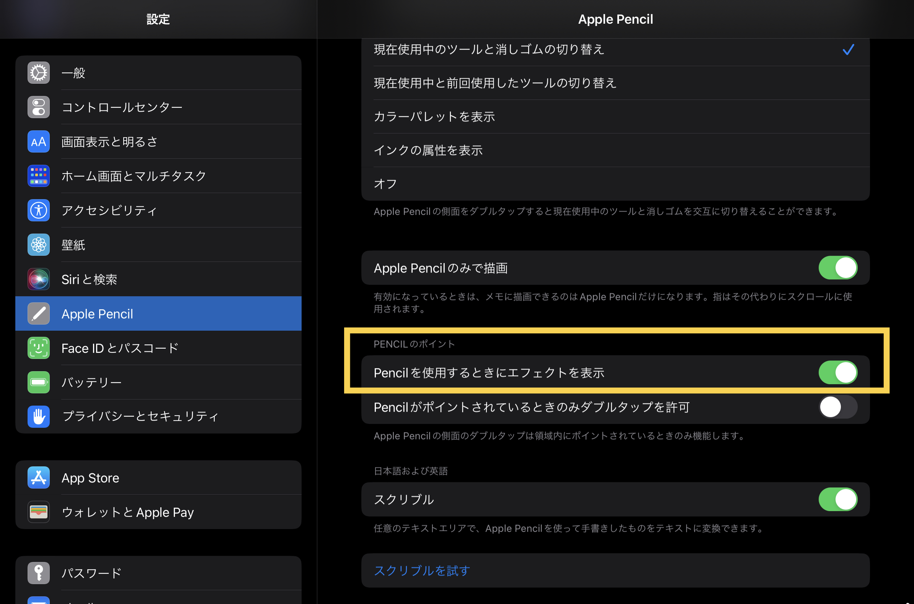

# Apple Pencil のホバー機能を試す

宇佐見公輔 / 株式会社ゆめみ

<!--
_class: lead invert
_paginate: false
_footer: ""
-->

# 自己紹介

* 宇佐見公輔（うさみこうすけ）
* 株式会社ゆめみ / iOSテックリード
* iOSDC Japan 2022で登壇、パンフレット記事執筆

  

# Apple Pencil のホバー検出

Apple PencilをiPadに直接タッチしていない状態を検出できるようになった

必要なもの：
* iPadOS 16.1（リリース日：2022-10-25）
* M2 iPad Pro（発売日：2022-10-26）
* Apple Pencil 2nd gen（これは以前からある）

# 実機での挙動

検出されるのは、タッチパネルから約1cm以内にペン先があるとき

iPadOS標準のメモアプリの例：
* 手書きモードで、ペン先が浮いている状態でペンのタッチ位置がプレビュー表示される
* ボタンなどのUIコントロールの上にかざすと、そのコントロールがハイライト表示される

# アプリでの検出方法

`UIHoverGestureRecognizer` を使えば良い

```swift
let hover = UIHoverGestureRecognizer(target: self, action: #selector(hovering(_:)))
button.addGestureRecognizer(hover)

@objc
private func hovering(_ recognizer: UIHoverGestureRecognizer) {
    // 検出時の処理
}
```

Appleのサンプル：[Adopting hover support for Apple Pencil](https://developer.apple.com/documentation/uikit/touches_presses_and_gestures/adopting_hover_support_for_apple_pencil)

# UIHoverGestureRecognizer

* [`UIHoverGestureRecognizer`](https://developer.apple.com/documentation/uikit/uihovergesturerecognizer) はiPadOS 13.0から存在している
* Viewの上をマウスポインターがホバーしたことを検出する
* iPadOS 16.1からApple Pencilのホバーも検出する

つまり、マウスポインターのホバーと同じ挙動が期待されている
* UIコントロールのハイライト表示など
* 標準のUIコントロールは自動的に対応する

# zOffset

* `UIHoverGestureRecognizer` プロパティ [`zOffset`](https://developer.apple.com/documentation/uikit/uihovergesturerecognizer/4098402-zoffset) がiPad16.1で追加
* 0〜1の値でタッチパネルからの距離が取得できる
* Apple Pencilでない場合は常に0の値

ペン先のタッチ位置のプレビュー表示に活用できる

# プレビュー表示

どのようなプレビュー表示をするかは、現在はガイドラインがない
* 標準メモアプリは単純にポイント位置を点で表示している？
* サンプルコードでは距離によってアルファ値を変えている
    * これは意味があるかどうか？

単純な表示でも、ユーザーにとっての使い勝手は向上する

# ホバー検出の有効化・無効化



# まとめ

* M2 iPad Proのみの機能
* `UIHoverGestureRecognizer` で検出できる
* 標準のUIコントロールなら何もしなくてもハイライト表示される
* Pencilのタッチ操作を想定するならプレビュー表示対応すると良い
* プレビュー表示のガイドラインはまだない
