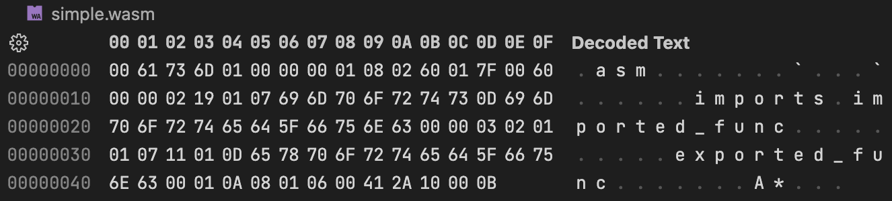
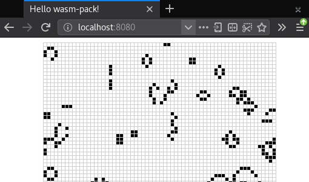

# Rust＋WebAssemblyを<br>さわってみた話

宇佐見公輔
2022-12-09

<!--
_class: lead invert
_paginate: false
_footer: ""
-->

# 自己紹介

* 宇佐見公輔（うさみこうすけ）
* 株式会社ゆめみ / iOSテックリード
* 大阪在住、最寄のゆめみオフィスは京都
* KyotoLT参加2回目

# Rust＋WebAssembly

* Rustから見た場合
    * Rust言語の活用方法のひとつとして
    * RustでWebフロントエンド開発ができる
* WebAssemblyから見た場合
    * WebAssembly形式を生成する手段のひとつとして
    * コンパクトかつ高パフォーマンスなwasmバイナリを生成できる

# WebAssemblyとは

<!--
_class: lead invert
-->

# WebAssemblyとは

* Webブラウザー上で実行できるバイナリ形式
    * かつてJavaもやっていたが……
* ブラウザーに組み込まれた仮想マシン上で実行される
    * JavaScriptも仮想マシン上で実行される
    * WebAssemblyのほうが高速に動作する

# JavaScriptとWebAssembly

* 両者を併用する
    * WebAssemblyですべてをカバーはできない
    * WebAssemblyでJavaScriptを補強する
* JavaScriptからWebAssemblyの関数を呼び出せる
* WebAssemblyからJavaScriptの関数を呼び出せる

# WebAssemblyの事例

* Google Meet
* Google Earth
* Figma
* eBay

など……

# WebAssemblyバイナリ

<!--
_class: lead invert
-->

# WebAssemblyバイナリ



```
magic   ::= 0x00 0x61 0x73 0x6D
version ::= 0x01 0x00 0x00 0x00
```

（参考：ELFバイナリだと先頭4バイトは `0x7F 0x45 0x4C 0x46`）

# WebAssemblyバイナリの生成方法

* WebAssemblyテキストを記述して生成する
* C/C++ソースコードからEmscriptenで生成する
* Rustソースコードからwasm-packで生成する
* AssemblyScriptソースコードから生成する

# WebAssemblyテキスト

* WABT（WebAssembly Binary Toolkit）でバイナリに変換
* `wat2wasm simple.wat -o simple.wasm`

```wasm
(module
  (func $i (import "imports" "imported_func") (param i32))
  (func (export "exported_func")
    i32.const 42
    call $i
  )
)
```

# Emscripten

* C/C++コンパイラの代わりにEmscriptenコンパイラを使う
* `emcc hello.c -o hello.html`（wasm、js、htmlを生成）

```c
#include <stdio.h>

int main() {
    printf("Hello World\n");
    return 0;
}
```

# Rust wasm-pack

* cargo buildの代わりにwasm-packツールでビルドする
* `wasm-pack build --target web`（wasm、jsを生成）

```rust
use wasm_bindgen::prelude::*;

#[wasm_bindgen]
pub fn greet(name: &str) {
    alert(&format!("Hello, {}!", name));
}
```

# AssemblyScript

* TypeScriptのサブセット
* AssemblyScriptはWebAssemblyにコンパイルされる
    * `asc sample.ts --outFile sample.wasm`
* 対比：TypeScriptはJavaScriptにトランスパイルされる
    * `tsc sample.ts --outFile sample.js`

# RustでWebAssemblyバイナリを生成

<!--
_class: lead invert
-->

# 環境準備

* Rust環境の準備
    * `rustup` で `rustc` や `cargo` のインストール
* wasm-pack導入
    * `cargo install wasm-pack`

# プロジェクト作成

* プロジェクト作成
    * `cargo new --lib`
* `Cargo.toml` 設定

```toml
[lib]
crate-type = ["cdylib"]

[dependencies]
wasm-bindgen = "0.2"
```

# RustからJavaScriptの関数を呼ぶ

```rust
#[wasm_bindgen]
extern {
    pub fn alert(s: &str);
}
```

* これで `alert` がRustから呼べるようになる
    * `alert` はJavaScriptで提供される関数

# JavaScriptからRustの関数を呼ぶ


```rust
#[wasm_bindgen]
pub fn greet(name: &str) {
    alert(&format!("Hello, {}!", name));
}
```

* これで `greet` がJavaScriptから呼べるようになる
    * `greet` はRustで実装した関数
    * 先ほどの `alert` をRustで使っている

# WebAssemblyのビルド

* wasm-packでビルド
    * `wasm-pack build --target web`
* 生成物
    * WebAssemblyバイナリ
    * JavaScriptファイル（WebAssemblyのラッパー）

# WebAssemblyのロード

```html
<body>
  <script type="module">
    import init, {greet} from "./pkg/hello_wasm.js";
    init()
      .then(() => {
        greet("WebAssembly")
      });
  </script>
</body>
```

# Webサーバーの準備と実行

* MIMEタイプ `application/wasm` に対応したWebサーバーの準備
    * `python3 -m http.server` で良い
* Webブラウザーでアクセス
    * `http://localhost:8000`
    * うまくいけばアラートボックスが表示される

# より実践的なチュートリアル

* Conwayのライフゲーム 
* The Rust Wasm Book https://rustwasm.github.io/docs/book/

# 情報源

* WebAssembly | MDN Web Docs
    * https://developer.mozilla.org/ja/docs/WebAssembly
* Rust and WebAssembly Documentation
    * https://rustwasm.github.io/docs.html
* 入門WebAssembly（Rick Battagline、翔泳社）
