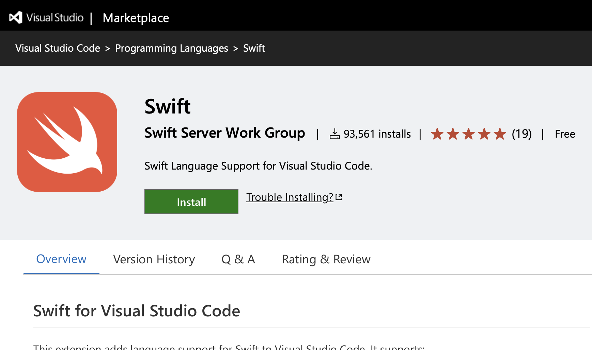

# Swift Extension  for Visual Studio Code

宇佐見公輔 / 株式会社ゆめみ
2023-02-27

# Swiftの開発環境

* CLI
* Xcode
* Swift Playgrounds

これに加えて：

* Visual Studio Code

# Swift Extension

# Swift Extensionの開発対象

Swift Package Managerプロジェクトの開発が主な対象。

アプリ開発は、このSwift Extensionの対象からは外れる。
（アプリ開発向けには、別のExtensionがある）

# Swift Extensionの機能

* Swift言語サポート
* Swift Packageサポート
* デバッガー
* 単体テスト
* その他のVisual Studio Codeとしての利点

# Swift言語サポート

* SourceKit-LSP（LSP = Language Server Protocol）
    * コード補完
    * コードジャンプ

# Swift Packageサポート

* Visual Studio Code上でビルド
    * ビルドタスクの自動作成
    * ビルドエラー表示
* 依存パッケージ管理
    * Package Dependency View

# デバッガー

* Visual Studio Code上でデバッグ
    * CodeLLDB Extensionとの連携
    * デバッグ設定の自動生成

# 単体テスト

* 単体テストの実行と管理
    * Test Explorer View

# Visual Studio Codeとしての利点

* 軽量
* Extensionの利用
* ワークスペース機能
* Dockerとの連携

# 参考

swift-server/vscode-swift: Visual Studio Code Extension for Swift
https://github.com/swift-server/vscode-swift

Swift.orgのブログ記事
https://www.swift.org/blog/vscode-extension/
