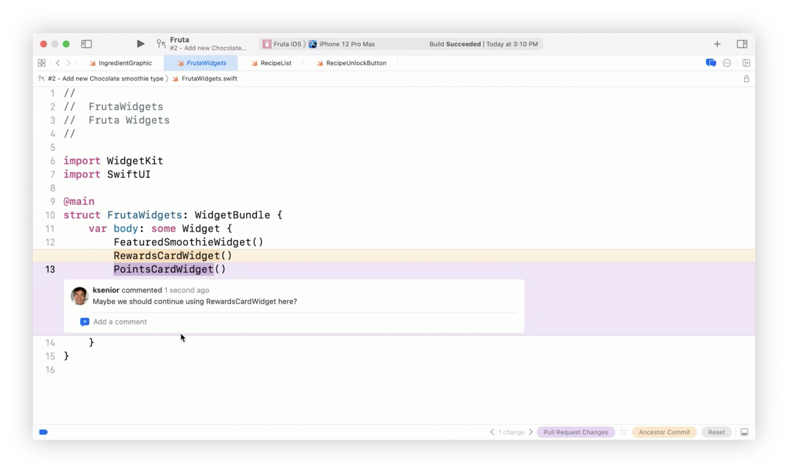
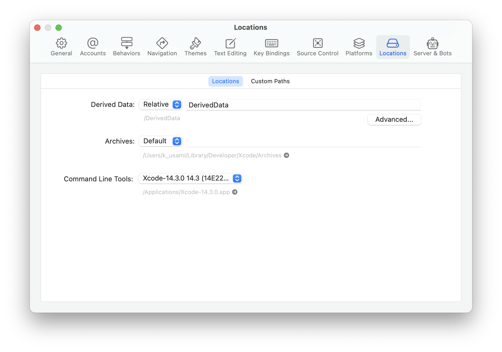
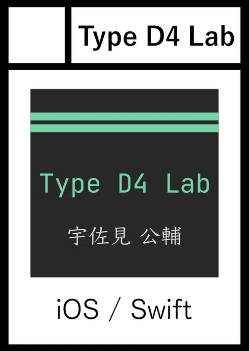

# Xcodeとの最近の付き合い方のはなし

宇佐見公輔 / 株式会社ゆめみ
2023-05-10

# 自己紹介

* 宇佐見公輔（うさみこうすけ）
* 株式会社ゆめみ / iOSテックリード
* 大阪在住

# Xcodeの状況

* 現在の最新はXcode 14.3
* 機能的にはだいぶ進化してきている
* ただ最近、ビルド周りで問題が多い気がする・・・

そんなXcodeとの最近の付き合い方について話してみます。

# Xcodeのインストール

* Xcodes.app (XcodesOrg/XcodesApp)
    * Xcodeのインストールが簡単にできる
    * バージョン違いのXcodeの共存が管理できる
* auramagi/NewIcon
    * Xcodeのアイコンを変更して区別しやすくする

# GitHub Pull Requestの表示

* レビューコメントをXcode上で確認できる
* PR出したりレビューしたりもできる

ref: WWDC21 Xcodeにおけるコードレビューと共同作業

# Copilot for Xcode

* intitni/CopilotForXcode
    * GitHub Copilotを使えるようにするXcode Extension
    * ChatGPTとの連携もできる
* 特定プロジェクトだけ有効にする
    * 「Disable suggestion feature globally」をオンにする
    * 有効にしたいプロジェクトを個別に指定する

# 最近聞くXcodeビルド時のトラブル

* ビルドが通るはずのコードでビルドエラーになる
* Gitブランチを切り替えるとビルドエラーになる
* クリーンしてもビルドエラーが解消されない
* 直近で変更した内容がビルドに反映されない

# Derived Data

* Derived Dataの位置を「Relative」にしておく
* プロジェクトフォルダー内にDerived Dataが作成されるので管理が楽になる
    * クリーンしたい時はこのフォルダーを削除

# git worktree

* Gitブランチごとに別々のフォルダーを作成する
    * `git worktree add "フォルダパス" "ブランチ名"`
* 前述の設定と組み合わせると、ビルド内容が混在しなくなる
    * そのためビルドの問題を回避しやすい
* 新しいブランチごとにフルビルドする格好になるのが欠点

# 未解決の問題

* プロジェクトをXcodeで開いたときSwift Package関連のエラーが多発する
    * プロジェクトを開き直すと解消する場合がある
    * Xcodeを再起動すると解消する場合がある

Xcodeの修正待ち・・・？

# 宣伝

* 技術書典14：
  5月20日（土）
  〜6月4日（日）
* 技書博8：
  5月28日（日）

