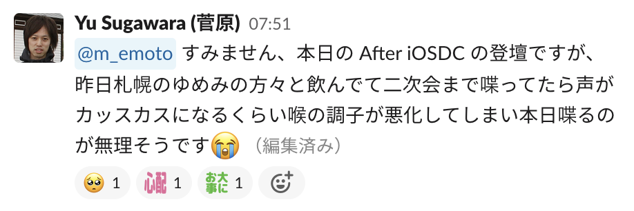
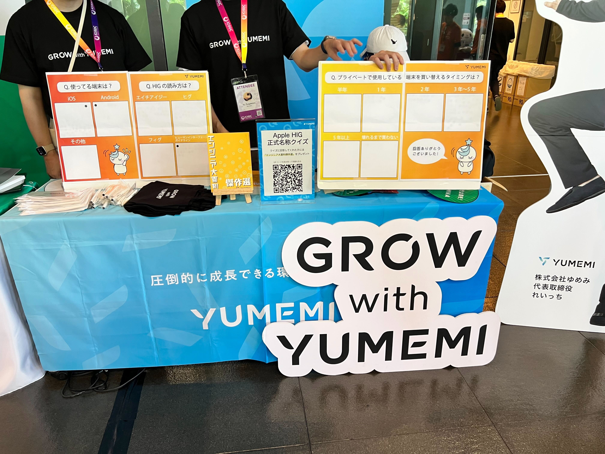
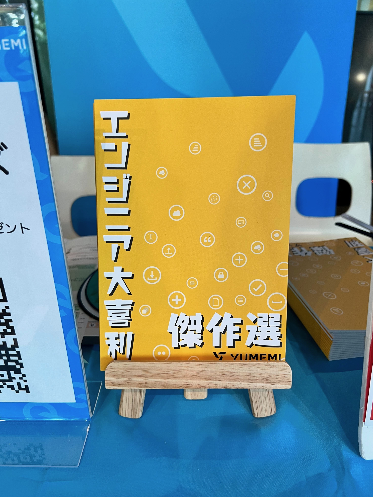
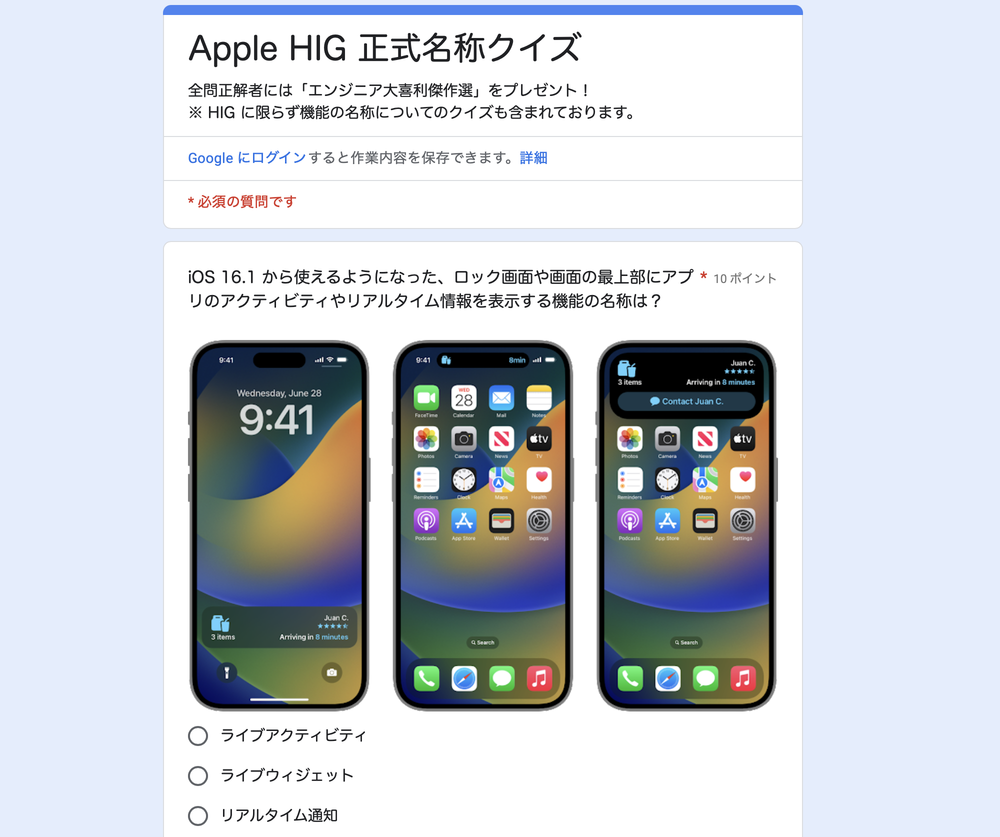

# Apple HIG 正式名称クイズ 結果発表
<!-- _class: lead invert -->

宇佐見公輔 / 株式会社ゆめみ
2023-09-08

# 今朝の出来事

クイズ制作者に登壇してもらう予定でしたが、

・・・というわけで、代理で話します。

# ゆめみのスポンサーブース

 

# Apple HIG 正式名称クイズ

全10問 / 100点満点

前半は易しめ、後半は難しめ

# 実際の結果は？

ここからは、Google Formで集計結果を見ながら話します。
