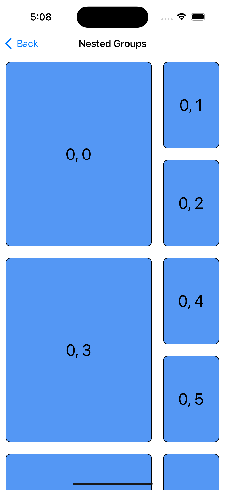
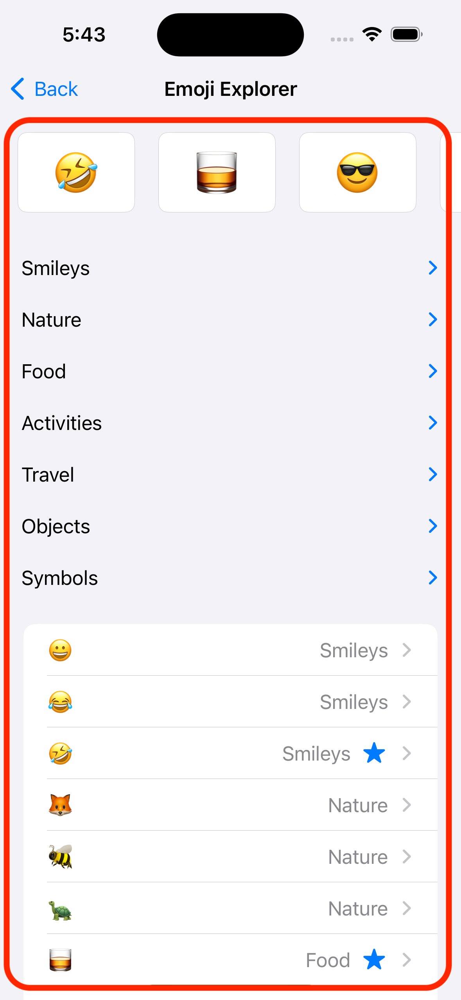

# UICollectionView <br>Compositional Layout 振り返り

宇佐見公輔 / 株式会社ゆめみ
2023-03-07

# 自己紹介

* 宇佐見公輔（うさみこうすけ）
* 株式会社ゆめみ / iOSテックリード
* 大阪在住


# UICollectionView

* iOS 6 で登場した
* iOS 13 / 14 で大きく進化した
    * Diffable Data Source
    * Compositional Layout


# API構成

* Data
* Layout
* Presentation


# Layout

* Layout クラス（抽象クラス）
    * `UICollectionViewLayout`
* Flow Layout : iOS 6〜
    * `UICollectionViewFlowLayout`
* Compositional Layout : iOS 13〜
    * `UICollectionViewCompositionalLayout`

# Compositional Layout でできること

   

# Compositional Layout の構成

* Layout
* Section
* Group
* Item


# Layout

ひとつのセクションにひとつの Section が対応する

```swift
let layout = UICollectionViewCompositionalLayout {
  (sectionIndex, layoutEnvironment) -> NSCollectionLayoutSection? in
  let section = NSCollectionLayoutSection(...)
  return section
}
```

※ 全部同じ Section の場合は簡単な `init` もある

```swift
let layout = UICollectionViewCompositionalLayout(section: section)
```

# Section

ひとつの Group を持つ

```swift
let section = NSCollectionLayoutSection(group: group)
```

ただし、Group はネストできる

```swift
let subgroups: [NSCollectionLayoutGroup] = ...
let group = NSCollectionLayoutGroup.vertical(
  layoutSize: ..., subitems: subgroups
)
let section = NSCollectionLayoutSection(group: group)
```

# Group

ひとつまたは複数個の Item を持つ

```swift
let group = NSCollectionLayoutGroup.vertical(
  layoutSize: ..., subitems: items
)
```

```swift
let group = NSCollectionLayoutGroup.horizontal(
  layoutSize: ..., subitems: items
)
```

# Item

ひとつのデータに対応する

```swift
let item = NSCollectionLayoutItem(layoutSize: ...)
```

# それぞれの関係まとめ

* Layout はセクションごとに Section を持つ
* Section はひとつの Group を持つ（Group のネスト可能）
* Group はひとつまたは複数個の Item を持つ
* Item はひとつのデータに対応する

# Section / Group

* 「いくつかのものを並べる」のはどちらも同じ
* どんなかたまりを Section にしたらいいのか？
* どんなかたまりを Group にしたらいいのか？




# Section と Group の違い

* Section
    * Section 単位で設定する機能がある
    * ネストできない
* Group
    * Group 単位の機能はなく、レイアウト定義用のもの
    * ネストできる

# Section の機能 (1)

* Sticky Header
    * `pinToVisibleBounds`
* セクションが変わると Pinned になっていたヘッダーが消えてしまう
* そのため、セクションの範囲を考慮する必要がある


# Section の機能 (2)

* 横スクロール
    * `orthogonalScrollingBehavior`
* これはセクションのプロパティ
* 横スクロールしたい部分だけでセクションにする必要がある


# Section の範囲を考える

* Section はネストできない
* そのため、セクションわけは実現したい機能に応じて決める必要がある

# ふたつの機能が両立しないケース

* Sticky Header を右のような単位でつけたいとする
* すると、上部分の横スクロールを `orthogonalScrollingBehavior` では実現できなくなる


# まとめ

* Section と Group はグルーピングの構造だが、役割が違う
* セクション単位で UI の機能を意識する必要がある

感想・ツッコミ・指摘・アドバイスなど歓迎します。

* Sticky Header と横スクロールを両立する方法が知りたい
    * CollectionView in CollectionView か？
