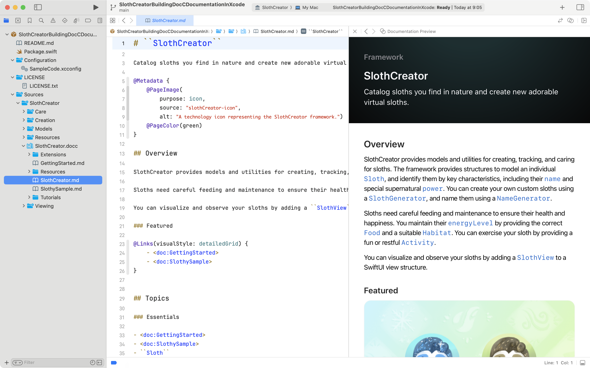

# Xcode 15の<br>DocCプレビュー機能の紹介
<!-- _class: lead invert -->

宇佐見公輔 / 株式会社ゆめみ
2023-11-08

# 自己紹介

* 宇佐見公輔（うさみこうすけ）
* 株式会社ゆめみ / iOSテックリード

 

# Swift-DocC

* Swiftのドキュメント作成ツール
    * APIドキュメント
    * チュートリアル
* 現在の公式ドキュメントの多くがSwift-DocCで作成されている
* Xcode 13に含まれる形でリリース（2021）

# Swift-DocCの更新 (1)

* Xcode 14に含まれる形でアップデート（2022）
    * Appプロジェクト対応
    * SwiftPMプラグイン対応
    * Objective-C対応
    * その他、細かな改善

# 余談

* SwiftPMプラグイン
    * Swiftパッケージには対応している
    * Appのマルチモジュール構成ではうまくいかない
        * 情報求む

# Swift-DocCの更新 (2)

* Xcode 15に含まれる形でアップデート（2023）
    * プレビュー機能
    * Swift extension対応
    * その他、細かな改善

# Xcode向けのサンプル

* SlothCreator: Building DocC Documentation in Xcode | Apple Developer Documentation
    * https://developer.apple.com/documentation/xcode/slothcreator_building_docc_documentation_in_xcode

# プレビュー機能（Xcode 15）



# 使いかた

Assistantウィンドウで「Documentation Preview」を選ぶ


# プレビュー機能のメリット

* 実際の出力と同じ見た目でプレビューできる
    * 他のエディターでもプレビューできるが見た目が変わる
* 固有の機能をプレビューできる
    * Markdown拡張ディレクティブ
    * チュートリアル

# 拡張ディレクティブ

* レイアウトのためのディレクティブがある（Swift 5.8以降）
    * `@Row` / `@Column`
    * `@TabNavigator`
    * `@Small`
    * `@Links`
* これらを使うときはプレビュー機能が便利

# @Row / @Column

```markdown
@Row {
   @Column {
      @Image(source: "icon-power-icon", alt: "A blue square containing a snowflake.") {
         Ice power
      }
   }

   @Column {
      @Image(source: "fire-power-icon", alt: "A red square containing a flame.") {
         Fire power
      }
   }
}
```

# @Row / @Column


# @TabNavigator

```markdown
@TabNavigator {
   @Tab("Powers") {
      
   }

   @Tab("Excerise routines") {
      
   }

   @Tab("Hats") {
      
   }
}
```

# @TabNavigator

  

# まとめ

* Swift-DocCは少しずつ進化している
* Xcodeのサポートも少しずつ増えている
* 機会があれば使ってみると良さそう
