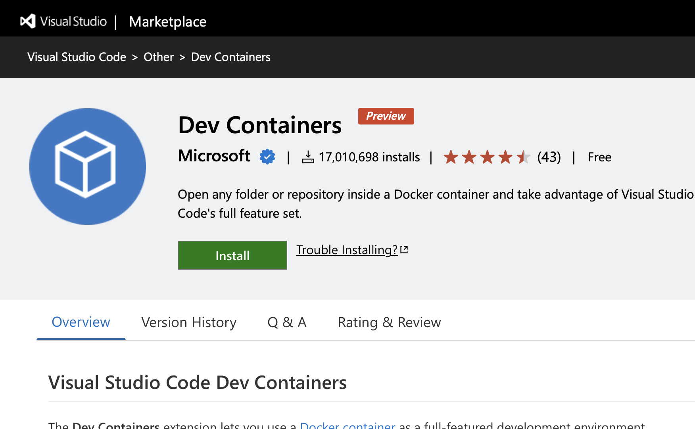

# Coding Swift  with Visual Studio Code  and Docker

宇佐見公輔 / 株式会社ゆめみ
2023-03-03

# Swiftの開発環境

* CLI
* Xcode
* Swift Playgrounds

# Swift with Visual Studio Code

# 開発対象

* Swift Package開発が対象
    * 実行バイナリ、ライブラリ
    * サーバーサイド
* アプリ開発は対象外

# 機能

* Swift言語サポート
    * コード補完、コードジャンプ
* Swift Packageサポート
    * ビルドタスク、依存パッケージ管理
* デバッガー
* 単体テスト

# Visual Studio Codeとしての利点

* 軽量
* Extensionの利用
* ワークスペース機能
* Dockerとの連携

# Dockerとの連携

# Docker Containerの利用

* SwiftコードをLinux上で実行できる
    * 特にサーバーサイドSwiftの開発で有益
* ローカルにSwift開発環境がなくても開発できる
    * macOS以外でも開発環境が整えられる

# 準備

* Docker Desktopをインストール
    * ライセンスに注意
* Visual Studio CodeにDev Containers拡張をインストール

# Dev Container設定

* 設定用のコマンドがある
    * 「Dev Containers: Add Development Container Configuration Files」を実行
    * Swiftがすでに用意されているので選択すればOK
    * `devcontainer.json` を自動生成してくれる

補足：
最新のSwift 5.7ではビルドに失敗してしまった。
Swift 5.6なら大丈夫だった。

# Container上で実行

* Container上でプロジェクトを開く
    * 「Dev Containers: Reopen in Container」を実行
* Visual Studio Code上でビルド・デバッグ
    * 自動的にContainer上で実行してくれる

# 参考

swift-server/vscode-swift: Visual Studio Code Extension for Swift
https://github.com/swift-server/vscode-swift

Swift.orgのブログ記事
https://www.swift.org/blog/vscode-extension/
