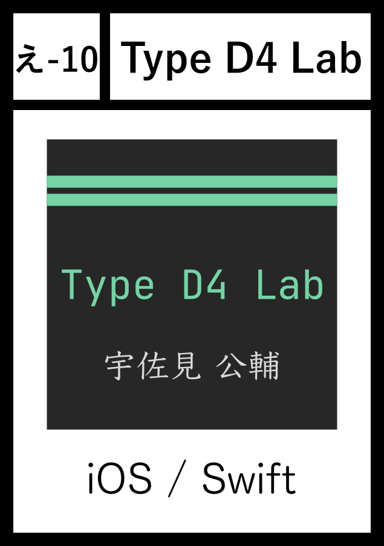
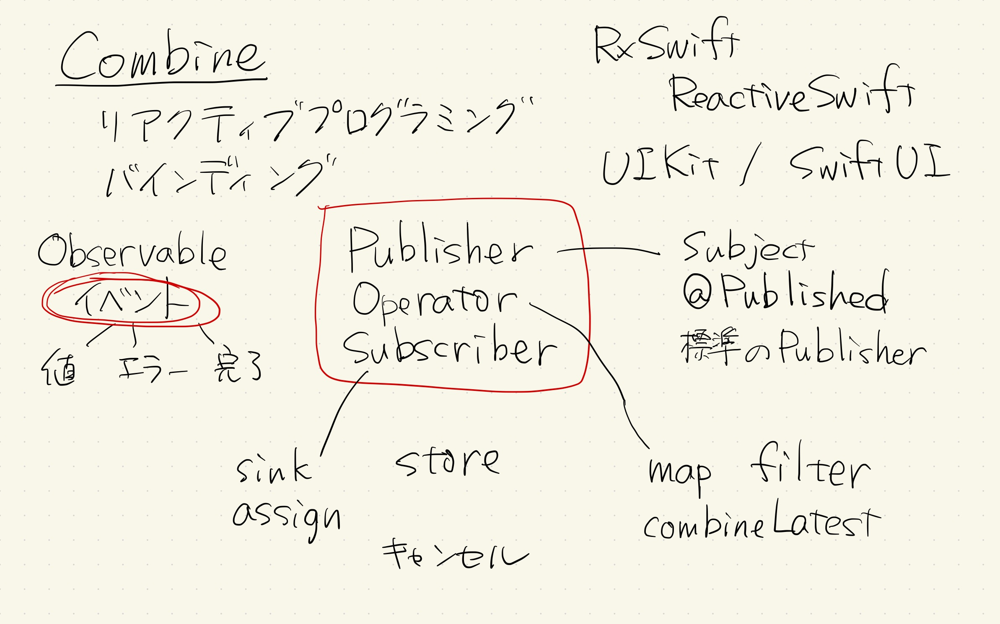

# 自分なりの技術書をつくりたい
<!-- _class: lead invert -->

宇佐見公輔 / 株式会社ゆめみ
2023-11-16

# 自己紹介

* 宇佐見公輔（うさみこうすけ）
* 株式会社ゆめみ / iOSテックリード
* 技書博9にサークル参加（予定）

# 既刊

   

# 新刊

* わかりやすい技術書を書く考えかた
* これまでどう考えてきたかを書いた

# わかりやすい技術書

* 書いてきた技術書について、分かりやすいと評価いただけている
    * 自分なりに気を配っていたポイントなのでありがたい
* ところで・・・
    * 分かりやすい技術書とは何か？
    * あるいは、読みやすい技術書とは何か？

# 自分が学んだ経験を振りかえる

* 何かを学ぶために技術書や技術記事を読んだ経験は誰もがある
* そのときに、自分がどんなことで苦労したか？
    * よくないパターンを考えてみる
    * その逆として、良いパターンが見えてくる

# よくないパターン1：途中で詰まる

* 前提知識が足りなくて、読み進められない
* 具体的な話になかなか入らなくて、もやもやする
* サンプルコードが長くて、大事な箇所がどこかつかめない
* 一度にたくさんのことを説明されて、混乱する
* 話の流れにギャップがあって、ついていけなくなる

# よくないパターン2：途中で飽きる

* 説明が後回しのまま単純作業が続いて、疲れる
* 知っている話が続いて、新しい学びが感じられない
* 同じ話がくりかえされて、飽きて読まなくなる

# 自分にとっての理想の技術書

* 実は結構、技術書を読むときに苦労している
* 後になってから、こんな解説があったら良かったなと思う
    * 最初からこう書いてくれていれば苦労しなかった、など
* 自分にとっての理想の技術書がほしい
* 自分なりの技術書を、自分でつくろう

# 技術同人誌をつくりはじめる

* 理想は目指しつつ、ハードルは低く
* 想定する読者は（昔の）自分
    * ひとまず、対象読者層などはさほど気にしない
* テーマは自分が書きたいもの
* 前提条件なども、自分の書きたいものに合わせて決める

# 自分なりの技術書としてこだわる点

* 途中で詰まらないで読み進められる
* 最小限の知識を得られる
    * その先は自分で楽に調べられる、というレベルまで導く
* より高いレベルは無理に目指さない
    * 難しいことを無理に詰め込まない
    * 他の本や記事が楽に読めるようになっているので問題なし

# 最初の本の場合

* 自分が学ぶときに苦労したことは？
    * 動くコードが欲しい
    * 基本的な概念の説明が欲しい
* それらを飛ばして、少し進んだ点を解説している本や記事が多かった印象がある
    * その気持ちはわかるけども

# 全体構成を考える

* ひとまず説明したい要素を挙げてみる
* 軸となる項目を選ぶ
* ひとつの概念の説明に一章を割く

# 重要なポイントを考える

* 今回は、最初の部分が書きたいポイントのひとつ
* 動くコードを最初に見せるというコンセプト
* ミニマムなサンプルコードを作ることにしっかり時間を割く
* 一度にひとつの概念だけ説明することを意識する

# 1冊目の完成とそれ以降

* 全体構成と重要なポイントを押さえたら、あとは書く
    * 無事に1冊目を完成
* その後も基本的には同じ流れで書いている

# まとめ

* 自分が欲しい技術書を自分で書く
* 自分が苦労したところを整理して分かりやすく書く
    * 最初からこう書いてくれていれば自分は苦労しなかった
* それが自分なりの技術書
