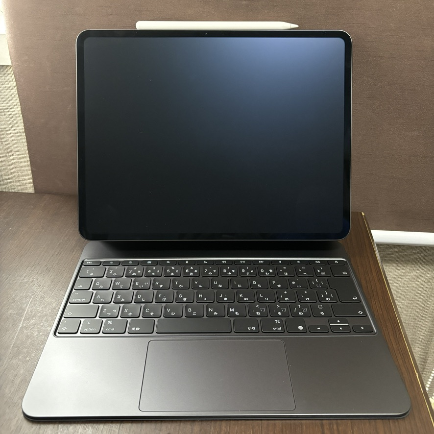
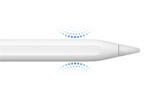
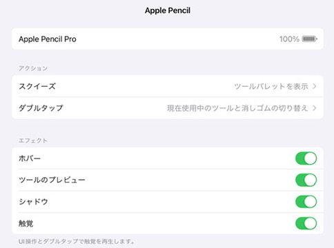
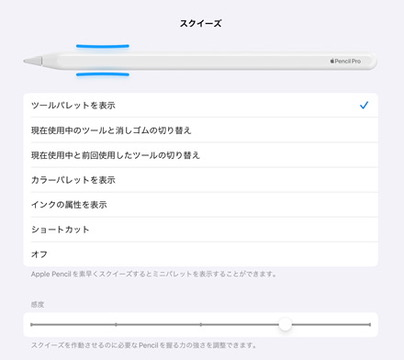

# Apple Pencil Proの新機能
<!-- _class: lead -->

宇佐見公輔 / 株式会社ゆめみ
2024-05-17
YUMEMI.grow Mobile #13

# 自己紹介

- 宇佐見公輔（うさみこうすけ）
- 株式会社ゆめみ / iOSテックリード
- 2024-05-17（水）に発売された新しいiPad Proを買いました
    - PencilやKeyboardと合わせた一式で42万円
- 前モデルのiPad Proも買っていて、その時もLTをしました
    - Apple Pencil のホバー機能を試す
      https://zenn.dev/usamik26/articles/pencil-hover

# iPad Pro (M4)

- 13インチ iPad Pro (M4)
    - nano-textureガラス
- Apple Pencil Pro
- Magic Keyboard



# Apple Pencil Pro

- ホバー（Pencil 2ndからの機能）
- ダブルタップ（Pencil 2ndからの機能）
- バレルロール（軸を回転する）
- スクイーズ（指で挟んで押す）
- 触覚フィードバック
- 「探す」アプリ対応

ref. https://www.apple.com/jp/apple-pencil/




# Apple Pencil Pro対応モデル

現状、2024-05-15に発売された以下のモデルのみが対象

- iPad Pro (M4) 13インチ / 11インチ
- iPad Air (M2) 13インチ / 11インチ

# 設定

- アクション変更可能
    - スクイーズ
    - ダブルタップ



# スクイーズ

- ツールパレット
- 消しゴム
- ショートカット

など



# Apple Pencil対応のための開発情報

- Apple Pencil | Apple Developer Documentation
  https://developer.apple.com/documentation/ApplePencil
- PencilKit | Apple Developer Documentation
  https://developer.apple.com/documentation/pencilkit

# SwiftUI / UIKit

- Apple Pencil interactions | Apple Developer Documentation
  https://developer.apple.com/documentation/uikit/apple_pencil_interactions

iOS 17.5でAPIが追加されている

- SwiftUI : Pencil対応のModifierが追加
- UIKit : PencilのDelegateにスクイーズ対応が追加

# SwiftUI Modifier追加

```swift
var body: some View {
    MyView()
        .onPencilSqueeze { phase in
            // スクイーズの処理
        }
}
```

- iOS 17.5 で追加
    - `onPencilDoubleTap(perform:)`
    - `onPencilSqueeze(perform:)`

# スクイーズの処理

- `PencilPreferredAction` で処理を分ける
    - `.showContextualPalette`
    - `.switchEraser`
    - `.switchPrevious`
    - `.showColorPalette`
    - `.showInkAttributes`
    - `.runSystemShortcut`
    - `.ignore`

# UIKit スクイーズ対応

```swift
class ViewController: UIViewController, UIPencilInteractionDelegate {
   
   override func viewDidLoad() {
       let pencilInteraction = UIPencilInteraction(delegate: self)
       view.addInteraction(pencilInteraction)
   }

    func pencilInteraction(_ interaction: UIPencilInteraction,
               didReceiveSqueeze squeeze: UIPencilInteraction.Squeeze) {
        // スクイーズの処理
    }
}
```

# UIKitの変更

- iOS 17.5 で追加
    - `pencilInteraction(_:didReceiveTap:)`
    - `pencilInteraction(_:didReceiveSqueeze:)`
- deprecated
    - `pencilInteractionDidTap(_:)`

# まとめ

- iOS 17.5でApple Pencil対応のAPIが追加
    - SwiftUI / UIKitでダブルタップやスクイーズの対応が可能
- 現時点での不明点
    - バレルロールの対応方法
    - 分かる人がいたら教えてください
