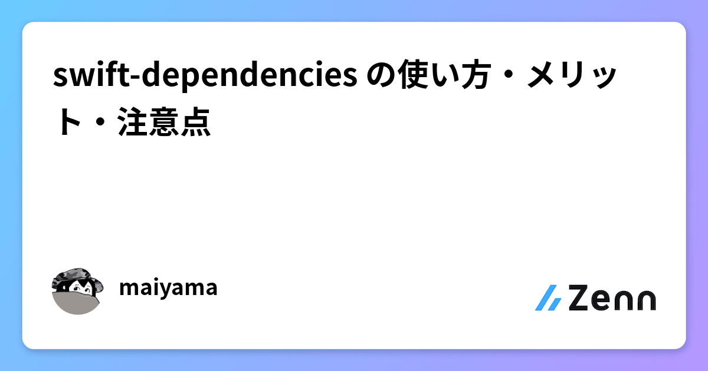

# swift-dependenciesによるDI
## structによるインターフェイス定義
<!-- _class: lead -->

宇佐見公輔 / 株式会社ゆめみ
2024-02-29

# swift-dependenciesとは

Point-FreeによるDI（Dependency Injection）ライブラリ。
https://github.com/pointfreeco/swift-dependencies

* バージョン
    * 0.1.0 : 2023年1月
    * 1.0.0 : 2023年7月
    * 1.2.1 : 2024年2月
* The Composable Architecture（TCA）の一部でもある。

# 参考記事

次の記事が分かりやすいのでオススメ。
[swift-dependencies の使い方・メリット・注意点](https://zenn.dev/mayaa/articles/409c07b5d9e0cb)


なお、今回の話では上述の記事に書かれていない点も取り上げる。

# 依存オブジェクトの注入

`@Dependency`プロパティラッパーを使う。

```swift
final class MainViewModel {
    @Dependency(\.myAPIClient) private var myAPIClient

// ...

    do {
        let result = try await myAPIClient.fetch()
    }
}
```

# `@Environment`との類似

swift-dependenciesの記法は、SwiftUIの`@Environment`と似ている。

```swift
struct MainScreen: View {
    @Environment(\.openURL) private var openURL

// ...

    Button("Open") {
        openURL(url)
    }
}
```

# 依存オブジェクトの実装

プロトコルで依存オブジェクトのインターフェイスを定義しておく。

```swift
protocol MyAPIClientProtocol {
    func fetch() async throws -> Int
}

struct MyAPIClient: MyAPIClientProtocol {
    func fetch() async throws -> Int {
        // ...
        return number
    }
}
```

# 依存オブジェクトの登録

`DependencyKey`プロトコルを使う。

```swift
private enum MyAPIClientKey: DependencyKey {
    static let liveValue: any MyAPIClientProtocol = MyAPIClient()
}

extension DependencyValues {
    var myAPIClient: any MyAPIClientProtocol {
        get { self[MyAPIClientKey.self] }
        set { self[MyAPIClientKey.self] = newValue }
    }
}
```

# カスタムEnvironmentとの類似

やはり、SwiftUIの`@Environment`の方法と似ている。

```swift
struct MyEnvironmentKey: EnvironmentKey {
    static let defaultValue: String = "Default value"
}

extension EnvironmentValues {
    var myEnvironment: String {
        get { self[MyEnvironmentKey.self] }
        set { self[MyEnvironmentKey.self] = newValue }
    }
}
```

# 注入するオブジェクトを変更する

テストで使うオブジェクトを`liveValue`以外のものに変更できる。

```swift
struct MyAPIClientMock: MyAPIClientProtocol {
// ...
}

private enum MyAPIClientKey: TestDependencyKey {
    static let testValue: any MyAPIClientProtocol = unimplemented()
    static let previewValue: any MyAPIClientProtocol = MyAPIClientMock()
}
```

# 注入するオブジェクトを個別変更する

`withDependencies`で個別変更できる。

```swift
let viewModel = withDependencies {
    $0.myAPIClient = MyAPIClientMock(fetchResult: .success(42))
} operation: {
    MainViewModel()
}
```

# インターフェイスの定義のしかた

ここまでの方法：プロトコルでインターフェイスを定義。

```swift
protocol MyAPIClientProtocol {
    func fetch() async throws -> Int
}
```

推奨：structとクロージャでインターフェイスを定義。

```swift
struct MyAPIClient {
    var fetch: () async throws -> Int
}
```

# 依存オブジェクトの実装と登録

```swift
@DependencyClient
struct MyAPIClient {
    var fetch: () async throws -> Int
}

extension MyAPIClient: DependencyKey {
    static var liveValue: MyAPIClient = {
        return .init(fetch: {
            // ...
            return number
        })
    }()
}
```

# `@DependencyClient`マクロ

`testValue`向けの実装を自動生成してくれる。

```swift
@DependencyClient
struct MyAPIClient {
    var fetch: () async throws -> Int
}

extension MyAPIClient: TestDependencyKey {
    static var testValue = Self()
}
```

# 依存オブジェクトの注入

```swift
final class MainViewModel {
    @Dependency(MyAPIClient.self) private var myAPIClient

// ...

    do {
        let result = try await myAPIClient.fetch()
    }
}
```

なお、`DependencyValues`のextensionは不要。

# 注入するオブジェクトを変更する

```swift
let viewModel = withDependencies {
    $0[MyAPIClient.self].fetch = { return 42 }
} operation: {
    MainViewModel()
}
```

ここでも、`DependencyValues`のextensionは不要。

# メソッドだけの注入

```swift
@Dependency(\.myAPIClient.fetch) private var fetch
do {
    let result = try await fetch()
}
```

```swift
extension DependencyValues {
    var myAPIClient: MyAPIClient { // ←この注入方法では、これが必要になる
        get { self[MyAPIClient.self] }
        set { self[MyAPIClient.self] = newValue }
    }
}
```

# structインターフェイスの利点

プロトコルの場合は`MyAPIClientProtocol`、`MyAPIClient`、`MyAPIClientMock`、`MyAPIClientKey`とそれぞれ定義が必要。

structの場合は`MyAPIClient`だけですみ、シンプルになる。
`@DependencyClient`マクロも活用できる。

ただ、メソッドをクロージャで`init`に渡す記法は慣れがいるかも。
```swift
.init(method1: {},
    method2: {},
    method3: {})
```

# 応用

注入できるスコープは、メソッドや計算プロパティもあり。

```swift
func foo() {
    @Dependency(MyLogger.self) private var logger
    logger.notice("log messages")
}
```

ただし、公式ドキュメントによると、ライブラリを十分に理解してから使うべきとのこと。

ログやトラッキングなどの用途では問題なさそう。

# swift-dependenciesまとめ

* SwiftUIの`@Environment`に近い感覚で使える。
* structとクロージャによるインターフェイスの実装方法を使うと、少ない実装コードでDIができる。
* 注意すべき点もあるので、公式ドキュメントはちゃんと読むことを推奨。
