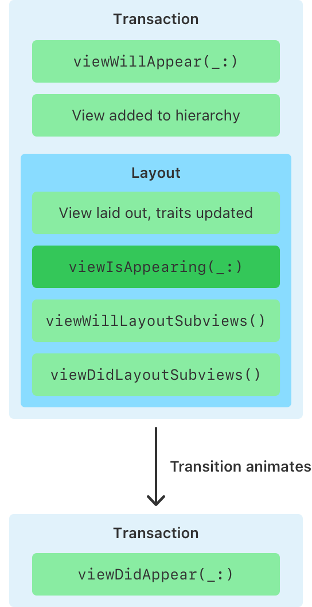
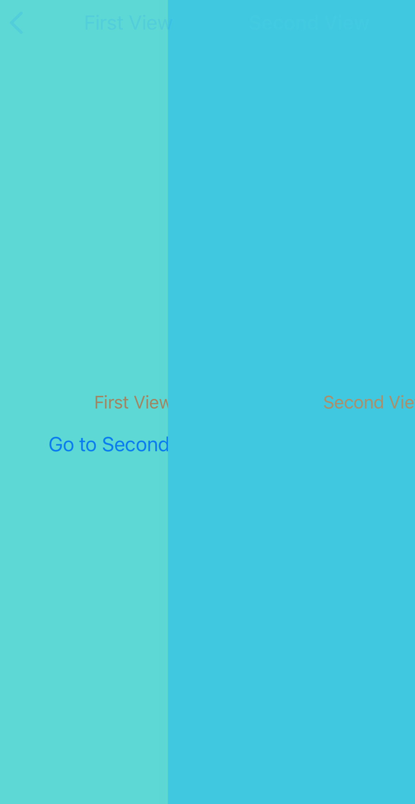

# ViewControllerのライフサイクル：viewIsAppearing
<!-- _class: lead -->

宇佐見公輔 / 株式会社ゆめみ
2024-02-14

# 自己紹介

* 宇佐見公輔（うさみこうすけ）
* 株式会社ゆめみ / iOSテックリード
* 前回のYUMEMI.grow Mobile
    * [SwiftのObservationフレームワークによる値の監視](https://www.docswell.com/s/usami-k/5EN7JD-swift-observation)
* 最近、コンタクトレンズを試している
    * Apple Vision Pro対応
    * まだ慣れないのでメガネと併用

# viewIsAppearingとは

UIViewControllerのライフサイクルのひとつ。

* 昨年6月のWWDC23で発表
* 最新のiOS 17だけでなく、iOS 13以降で使える
    * iOSで過去のバージョンへのbackportがあるのは珍しい
* 公式ドキュメントが詳しい
    * 今回の話の多くは公式ドキュメントに記載されている

# UIViewControllerのライフサイクル

特定のタイミングで `UIViewController` のメソッドが呼ばれる。

* `viewDidLoad` Viewのロード後 
* `viewWillAppear` Viewの表示前
* `viewWillLayoutSubviews` 子Viewのレイアウト前
* `viewDidLayoutSubviews` 子Viewのレイアウト後
* `viewDidAppear`　Viewの表示後

# ライフサイクルでの処理の実装

処理を実行したい場合、overrideする。

```swift
final class MyViewController: UIViewController {
    override func viewWillAppear(_ animated: Bool) {
        super.viewWillAppear(animated)

        // 実行したい処理を書く
    }
}
```

# 今回の追加

* `viewDidLoad`
* `viewWillAppear`
* `viewIsAppearing` ←ここ
* `viewWillLayoutSubviews`
* `viewDidLayoutSubviews`
* `viewDidAppear`

図は公式ドキュメントを引用



# viewWillAppearとviewIsAppearing

画面表示前の処理で、従来の定番は `viewWillAppear` だった。
これが `viewIsAppearing` でもできるようになった。

* 実行順
    * `viewWillAppear`
    * ViewControllerのViewがView階層に追加
    * ViewControllerのViewが親Viewにレイアウトされる
    * `viewIsAppearing`

# viewIsAppearingでできること

たとえば次のようなことができる。

* スクロール位置の調整
    * `viewWillAppear` より正確に調整できる
* Trait Collectionの参照
    * `viewWillAppear` ではまだ更新されていない

# Trait Collectionについて

トレイトシステムはiOS 17で更新されている。

* iOS 16までは、デバイスの向きやダークモードの切り替えなど
    * ライトモード / ダークモード
    * コンパクト / レギュラー
* iOS 17では、カスタムトレイトを追加できる
* また、トレイトの更新伝播の仕組みが変わっている

（今回は詳細は割愛）

# 使い分け

* `viewWillAppear`
    * `viewDidDisappear` と対になる処理
* `viewIsAppearing`
    * ViewControllerのViewがレイアウトされた後の処理
    * Trait Collectionの参照

# viewIsAppearingとviewWillLayoutSubviews

呼ばれる順番的には似ているが、呼ばれる回数が異なる。

* `viewIsAppearing`
    * 画面表示時に1回だけ呼ばれる
* `viewWillLayoutSubviews`
    * 複数回呼ばれる
    * `layoutSubviews()` のたびに呼ばれる

# 注意点

* 遷移元 `viewWillDisappear`
* 遷移先 `viewWillAppear`
* 遷移先 `viewIsAppearing`
* キャンセル
* 遷移先 `viewWillDisappear`
* 遷移元 `viewWillAppear`
* 遷移元 `viewIsAppearing`



# 注意点

スワイプで戻る→キャンセル、を考慮する。

* `viewWillAppear` が複数回呼ばれる可能性はある。
* `viewIsAppearing` が複数回呼ばれる可能性はある。
* どちらも、`viewWillDisappear` の処理と干渉する処理を入れてしまうとバグの原因になる。

とくに、遷移元も遷移先も同じNavigationControllerを参照している点に注意。

# 実際の例

* ツールバーの表示・非表示
    * 標準のツールバーはNavigationControllerに属する
* 以下の処理は、問題になるおそれがある
    * `viewWillAppear` や `viewIsAppearing` でツールバー表示
    * `viewWillDisappear` でツールバー非表示

# まとめ

今後は `viewIsAppearing` も適切に活用すると良い。
